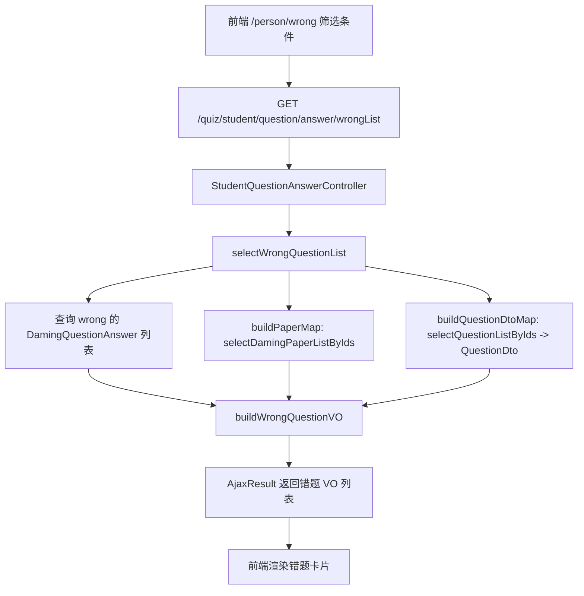

# 错题记录功能说明

## 功能概述
学生在「个人中心-错题记录」可查看全部做错的题目，支持按试卷名称、科目、时间范围筛选，并展示题干、选项、我的答案与正确答案，便于专项复习。后端通过批量预加载试卷与题目信息，避免 N+1 查询，提升性能。

## 数据流（Mermaid）


## 后端改动
1. `DamingQuestionAnswer` 新增 `beginTime/endTime/paperName` 查询条件。
2. `DamingQuestionAnswerServiceImpl.selectWrongQuestionList`：
   - 仅查询 `isCorrect=false`；非管理员自动限制为当前用户。
   - 批量查询试卷 (`selectDamingPaperListByIds`) 和题目 (`selectQuestionListByIds`) 构建 Map，拼装 `WrongQuestionVO`，避免循环查库。
3. 新建 `WrongQuestionVO`：封装题干、选项、标准答案、用户答案等。
4. 新增接口 `GET /quiz/student/question/answer/wrongList`，前端直接调用即可。

## 前端改动
- 新增 API `getWrongQuestionList`。
- `个人中心` 增加 “错题记录” 子路由 `/person/wrong`，提供筛选表单（试卷名、科目、时间范围）。
- 列表卡片展示题干、选项、我的答案、正确答案以及作答时间。

## 请求示例
```
GET /quiz/student/question/answer/wrongList?createUser=zww&paperName=期中&subjectId=1&beginTime=2025-10-01&endTime=2025-12-31
```

| 参数 | 说明 |
| --- | --- |
| createUser | 必填，当前登录账号（前端从 Vuex 读取） |
| paperName | 可选，模糊匹配试卷名称 |
| subjectId | 可选，按科目过滤 |
| beginTime/endTime | 可选，`yyyy-MM-dd`，作答时间范围 |

## 返回字段（Array\<WrongQuestionVO\>）
| 字段 | 说明 |
| --- | --- |
| answerId | 题目作答记录 ID |
| paperId / paperName | 所属试卷 |
| questionId / questionTitle | 错题题干 |
| questionType | 1 单选 / 2 多选 |
| options | 选项数组（`prefix/content`） |
| correct / correctArray | 标准答案 |
| userAnswer | 用户作答（逗号分隔） |
| questionScore / finalScore | 题目分值 / 实际得分 |
| subjectId | 科目 |
| createTime | 作答时间 |

## 注意事项
- 依赖学生账号登录，游客不可访问。
- 时间筛选需传 `beginTime/endTime`，Mapper 会进行 `date_format` 比较。
- 若后续需要分页，可在 Controller 层接入 PageHelper（当前为全量返回）。

## 后续优化方向
1. 支持一键移除/标记已掌握的错题。
2. 错题再练：在前端直接跳转到对应题目重做。
3. 分页与导出：错题多时可分页或导出为 Excel。

