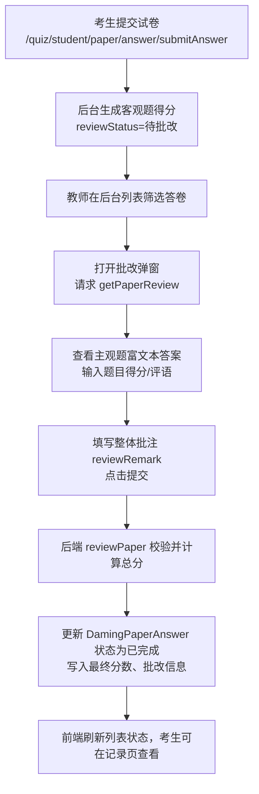

## 批改试卷流程说明

- 入口：教师端 `考试管理 > 试卷批改`，可按试卷名称、考生账号、批改状态（全部/待批改/已完成）筛选。
- 详情弹窗：调 `/quiz/student/paper/answer/getPaperReview/{id}`，包含原始试卷结构 `paperDto` 与答卷 `paperAnswerDto`，主观题以富文本展示学生答案。
- 批改：教师在主观题列表输入得分/评语、填写整体批注 `reviewRemark`，提交调用 `/quiz/student/paper/answer/review`。
- 后端：`DamingPaperAnswerServiceImpl.reviewPaper` 校验状态，累计主观题得分、更新 `finalScore`、设置 `reviewUser/ReviewTime/ReviewRemark`。
- 结果：列表刷新后状态切为“已完成”，考生可在个人记录查看最终得分。

