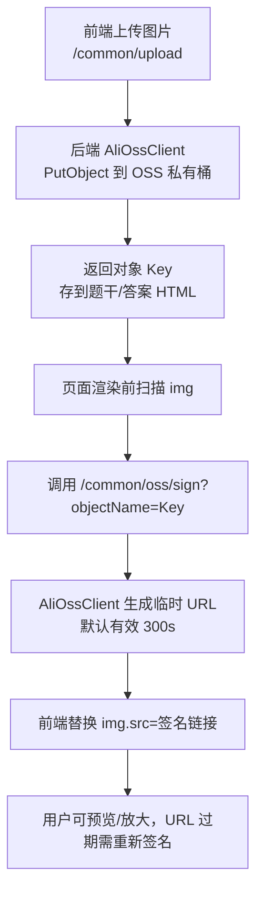
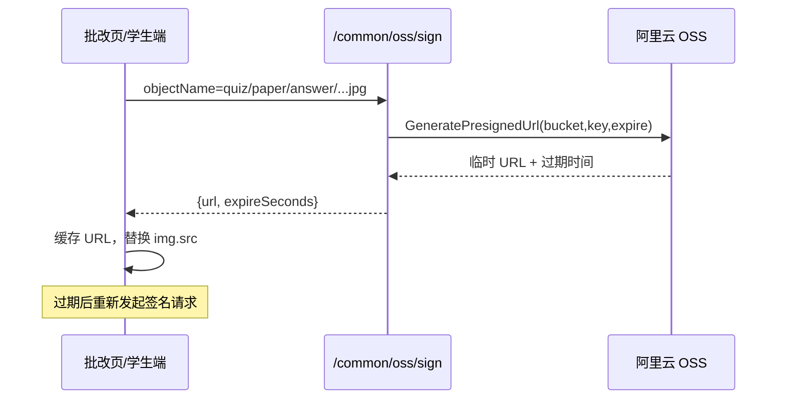

## OSS 私有上传与临时签名访问方案

- **背景**：富文本和批改场景的图片统一落 OSS（`daming-paper`），桶为私有，防止外链被刷。
- **核心能力**：
  1. 上传阶段仍走 `/common/upload`，后端使用固定 AK/SK 写入 OSS，保存对象 Key（如 `quiz/paper/answer/.../xxx.jpg`）。
  2. 访问阶段禁止直接暴露 OSS 域名，前端主动调用 `/common/oss/sign` 获取临时 URL（默认 5 分钟有效，服务器可自控过期时间）。
  3. 现有管理员批改页、C 端回顾页都会在渲染 HTML 后扫描 ``，将 Key 转成签名地址并缓存，点击图片走 Element Viewer。
- **配置要点**（`application.yml`）：
  - `aliyun.oss.enabled=true`
  - `endpoint=https://oss-cn-guangzhou.aliyuncs.com`
  - `bucketName=daming-paper`
  - `dir=quiz/paper/answer`
  - `accessKeyId/accessKeySecret` 使用 RAM 子账号

### 细节 & 注意事项
- **缓存策略**：前端按 Key 本地缓存 `url + expireAt`，提前 5 秒失效，避免频繁请求。
- **历史数据兼容**：若 `` 仍是 `upload/xxx` 等本地路径，会回落到原 `VUE_APP_BASE_API` 直链，不会签名。
- **安全性**：桶保持私有，仅后端掌握 AK/SK；签名 URL 有效期短，可根据业务调节 `expireSeconds` 或做限流日志。
- **后续扩展**：若要下载原始文件或生成 ZIP，可复用 `AliOssClient.generatePresignedUrl`（支持自定义 HTTP Method）或在后端流式转发。

