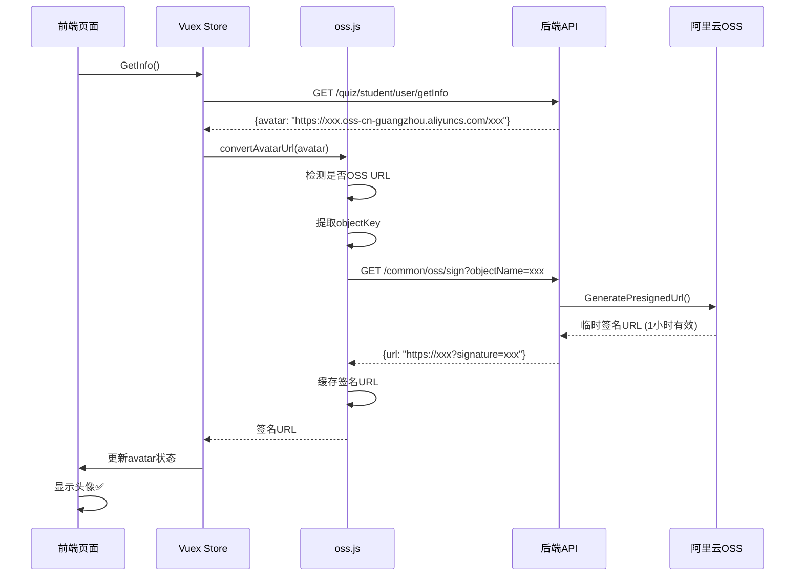

# 头像访问权限修复方案

## 问题描述

前台更新头像成功，但头像无法显示，浏览器访问头像URL时返回错误：

```xml
<Error>
  <Code>AccessDenied</Code>
  <Message>You have no right to access this object because of bucket acl.</Message>
  <RequestId>6923007B58E3C2363157D8E9</RequestId>
  <HostId>daming-paper.oss-cn-guangzhou.aliyuncs.com</HostId>
</Error>
```

## 问题原因

1. OSS bucket `daming-paper` 配置为**私有权限**（private），防止外链被恶意盗刷
2. 上传头像后返回的是普通OSS URL：`https://daming-paper.oss-cn-guangzhou.aliyuncs.com/xxx/xxx`
3. 浏览器直接访问私有bucket的URL时，OSS拒绝访问（需要签名验证）

## 解决方案对比

### 方案一：使用签名URL访问（已实施）✅

**优点：**
- ✅ 保持bucket私有权限，安全性高
- ✅ 符合现有架构设计（试卷图片也使用此方案）
- ✅ 无需修改OSS配置

**缺点：**
- ❌ 前端需要额外处理
- ❌ URL有有效期（默认1小时），过期需要重新获取

**实施方案：**

1. **创建OSS工具函数** (`src/utils/oss.js`)
   - `convertAvatarUrl()`: 自动识别OSS URL并转换为签名URL
   - `getOssSignedUrl()`: 调用后端接口获取临时签名URL
   - URL缓存机制：避免频繁请求

2. **修改Vuex Store** (`src/store/modules/user.js`)
   - `GetInfo` action中自动转换头像URL为签名URL

3. **修改个人信息页** (`src/views/person/info/index.vue`)
   - 组件初始化时转换头像URL
   - 更新头像后转换返回的URL

### 方案二：配置公共读权限（备选）

**优点：**
- ✅ 实施简单，无需修改代码
- ✅ URL永久有效

**缺点：**
- ❌ 降低安全性，任何人都可以访问
- ❌ 容易被盗链，浪费流量费用

**实施方案（如需使用）：**

有两种方式：

#### 方式A：为头像目录单独配置读权限

在阿里云OSS控制台：
1. 进入bucket `daming-paper`
2. 文件管理 → 找到头像目录（如 `quiz/avatar/`）
3. 批量操作 → 设置ACL → 公共读

#### 方式B：创建独立的公共bucket

1. 创建新bucket（如 `daming-avatar`）
2. 设置读写权限为：公共读
3. 修改配置，头像上传到新bucket

## 当前使用方案

**已采用方案一：签名URL方案**

### 使用说明

#### 前端开发者

头像URL会自动处理，无需手动转换：

```vue
<!-- 直接使用store中的头像即可 -->

```

#### 调用流程



### 缓存机制

- 签名URL缓存在内存中，按 `objectKey` 索引
- 缓存有效期：签名URL过期时间 - 5秒
- 自动刷新：URL过期前5秒自动重新获取

### 技术实现

```javascript
// 自动转换头像URL
import { convertAvatarUrl } from '@/utils/oss'

// 在组件中使用
async created() {
  const signedUrl = await convertAvatarUrl(originalUrl)
  this.avatar = signedUrl
}

// 在Store中使用
const avatarUrl = await convertAvatarUrl(user.avatar)
commit('SET_AVATAR', avatarUrl)
```

## 测试验证

1. **登录系统**，查看头像是否正常显示
2. **上传新头像**，检查是否立即回显
3. **刷新页面**，确认头像持久化
4. **打开浏览器开发者工具 Network**，查看头像URL应包含 `?Expires=` 等签名参数

## 注意事项

1. **签名URL有效期**：默认1小时，可在 `oss.js` 中调整
2. **缓存策略**：提前5秒失效，避免使用过期URL
3. **错误处理**：获取签名失败时，会回退到原始URL（虽然无法访问，但不会阻塞页面）
4. **性能优化**：相同objectKey的签名URL会被缓存，避免重复请求

## 相关文件

### 新增文件
- `daming-front/src/utils/oss.js` - OSS工具函数

### 修改文件
- `daming-front/src/store/modules/user.js` - 用户状态管理
- `daming-front/src/views/person/info/index.vue` - 个人信息页面

### 后端接口（无需修改）
- `POST /common/upload` - 上传文件
- `GET /common/oss/sign` - 获取签名URL
- `PUT /quiz/student/user/updateInfo` - 更新用户信息
