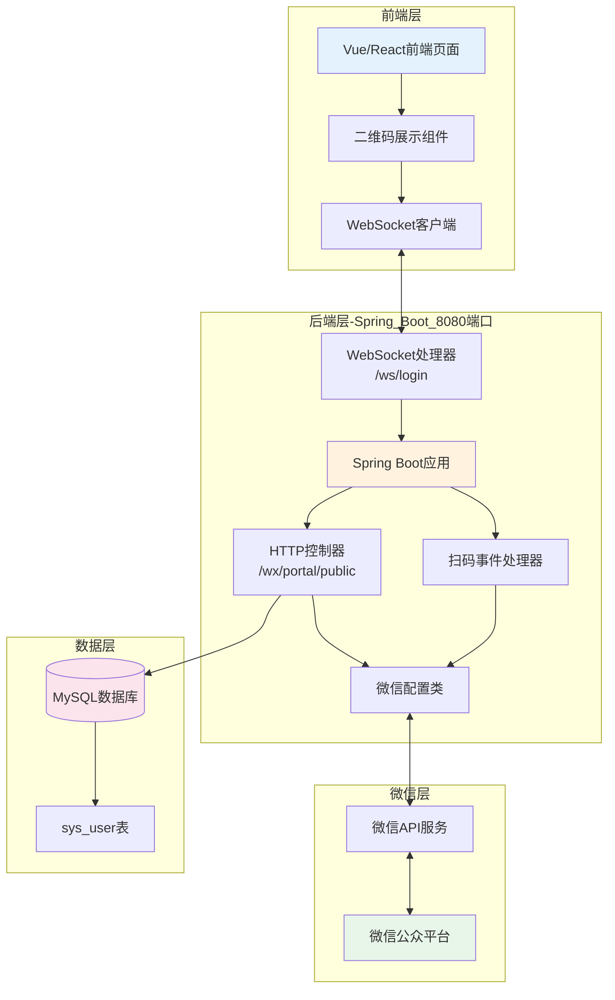
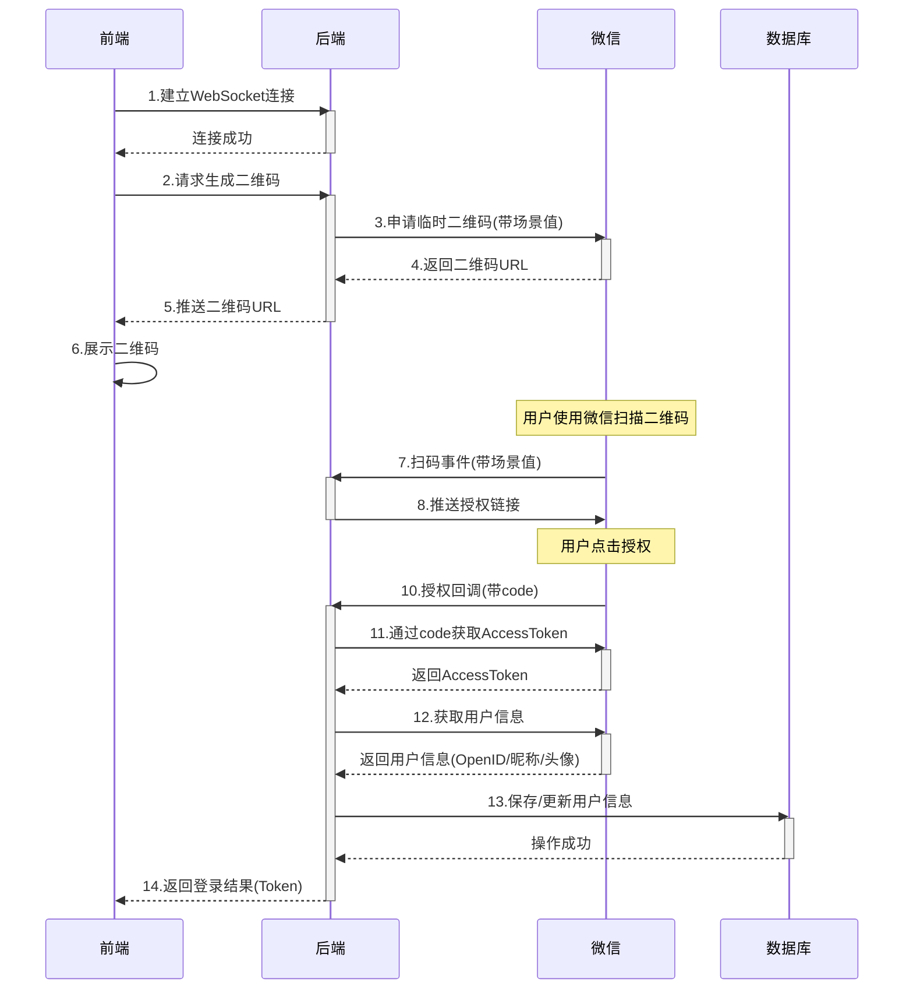
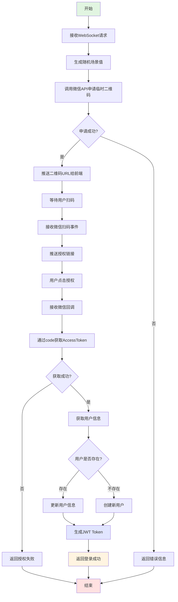
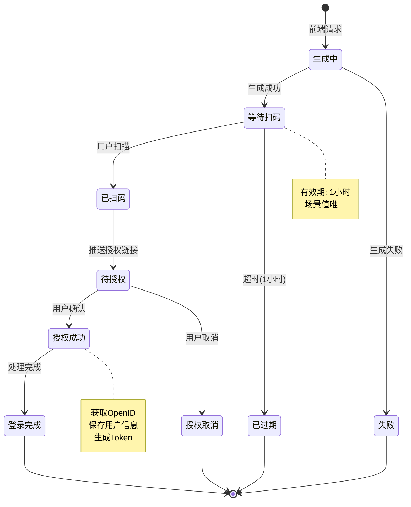
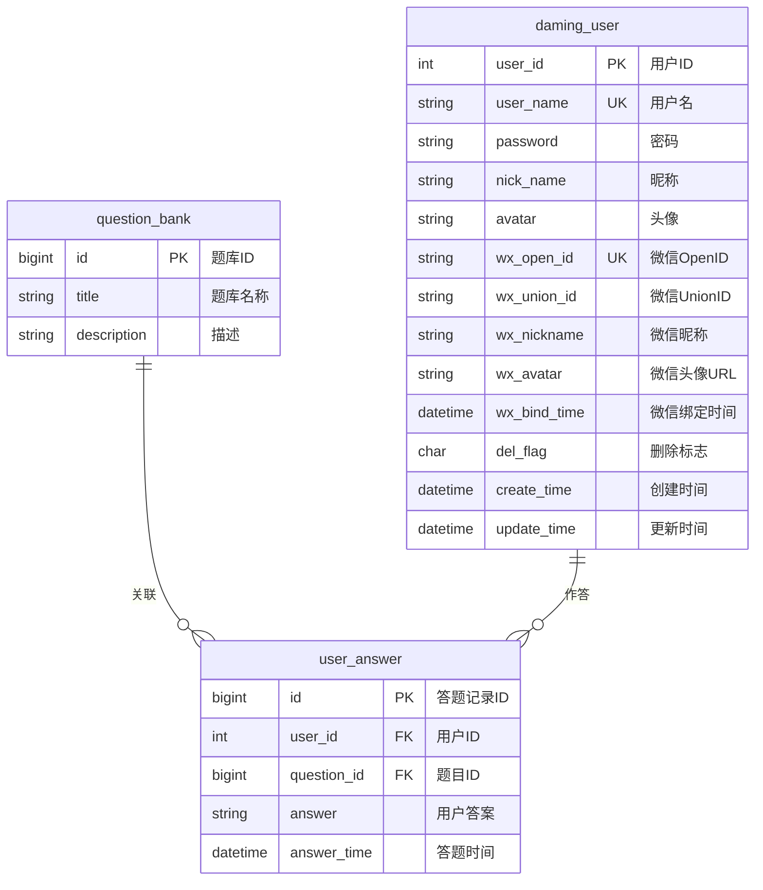

# 微信扫码登录功能设计文档

## 一、功能概述

实现用户通过微信扫码登录系统的功能，用户无需注册账号，通过微信授权即可快速登录。

## 二、技术架构

### 2.1 核心技术栈
- **WebSocket**: 使用Spring Boot内置WebSocket支持，统一8080端口
- **微信SDK**: `wx-java-mp-spring-boot-starter 4.6.0` 处理微信公众号相关接口
- **Hutool工具类**: 提供JSON等工具支持

### 2.1.1 技术选型说明
**为什么使用Spring WebSocket而不是Netty？**
- ✅ 与Spring Boot无缝集成，配置简单
- ✅ 统一端口管理，避免多端口复杂性
- ✅ 部署更简单，只需开放一个端口
- ✅ 自动支持CORS和安全配置
- ✅ 生产环境Nginx配置更简洁

### 2.2 系统架构图



### 2.3 时序图



### 2.3 后端处理流程图



### 2.5 二维码生命周期状态图



### 2.6 数据库关系图



**说明：** 
- `daming_user` 是前台用户表，支持密码登录和微信登录两种方式
- `wx_open_id` 有唯一索引，保证一个微信只能绑定一个账号
- `wx_union_id` 可用于跨公众号识别同一用户

## 三、实现细节

### 3.1 核心类说明

#### 配置类
- **WxMpProperties**: 微信公众号配置属性类，支持多公众号配置
- **WxMpConfiguration**: 微信服务配置类，初始化WxMpService和消息路由
- **WebSocketConfig**: WebSocket配置类，注册WebSocket端点和处理器

#### WebSocket相关
- **WxLoginWebSocketHandler**: WebSocket消息处理器，继承`TextWebSocketHandler`
  - 处理连接建立、消息接收、连接关闭
  - 生成并推送二维码
  - 管理所有活动会话
  - 支持点对点和广播消息

#### 微信相关
- **ScanHandler**: 扫码事件处理器，处理用户扫码后的授权流程
- **WxPortalController**: 微信门户控制器，处理回调和验证

### 3.2 关键点说明

#### 场景值(Scene ID)
- 每个二维码都有唯一的场景值，用于区分不同用户的登录请求
- 场景值范围: 1 ~ 2147483647 (Integer.MAX_VALUE)
- 临时二维码有效期: 1小时

#### 微信用户唯一标识
- **OpenID**: 用户在该公众号下的唯一标识
- 每个用户在不同公众号下的OpenID是不同的
- 通过OpenID可以区分和识别不同的微信用户

#### WebSocket端点
- **连接路径**: `ws://localhost:8080/ws/login`
- **生产环境**: `wss://your-domain.com/ws/login`
- **端口统一**: HTTP和WebSocket都使用8080端口
- **协议升级**: 通过HTTP Upgrade机制升级为WebSocket连接

### 3.3 数据库设计

**重要说明：** 微信扫码登录功能仅供**前台用户**使用，因此在前台用户表`daming_user`中新增以下字段：

| 字段名 | 类型 | 长度 | 说明 | 索引 | 必填 |
|--------|------|------|------|------|------|
| wx_open_id | VARCHAR | 64 | 微信OpenID（公众号下唯一标识） | UNIQUE | 否 |
| wx_union_id | VARCHAR | 64 | 微信UnionID（开放平台下唯一标识） | INDEX | 否 |
| wx_nickname | VARCHAR | 100 | 微信昵称 | - | 否 |
| wx_avatar | VARCHAR | 500 | 微信头像URL | - | 否 |
| wx_bind_time | DATETIME | - | 微信绑定时间 | - | 否 |

**字段说明：**
- **wx_open_id**: 用户在当前公众号下的唯一标识，用于登录验证（必须唯一）
- **wx_union_id**: 用户在同一开放平台下的唯一标识，可跨公众号识别同一用户
- **wx_nickname**: 微信昵称，用于显示
- **wx_avatar**: 微信头像URL，用于显示
- **wx_bind_time**: 记录用户首次绑定微信的时间

**业务场景：**
1. **纯微信登录**: 用户直接扫码，系统自动创建`daming_user`账号
2. **账号绑定**: 已有`daming_user`账号的用户，可绑定微信实现快捷登录
3. **账号解绑**: 支持解除微信绑定，恢复密码登录

## 四、配置说明

### 4.1 微信公众平台配置

1. 访问[微信公众平台](https://mp.weixin.qq.com/)
2. 申请开发者资质，获取AppID和AppSecret
3. 在"基本配置"中设置:
   - **服务器地址(URL)**: `http://your-domain.com/wx/portal/public`
   - **Token**: 自定义，与配置文件保持一致
   - **EncodingAESKey**: 可选，用于消息加密

### 4.2 应用配置

在`application.yml`中添加:

```yaml
# WebSocket端口
websocket:
  port: 9090

# 微信配置
wx:
  mp:
    callback: http://your-domain.com
    configs:
      - appId: your_app_id
        secret: your_app_secret
        token: your_token
        aesKey: your_aes_key
```

### 4.3 依赖说明

主要依赖:
- `wx-java-mp-spring-boot-starter:4.6.0` - 微信SDK Spring Boot Starter (包含自动配置)
- `spring-boot-starter-websocket` - Spring Boot WebSocket支持
- `hutool-all:5.7.20` - Hutool工具类

**技术选型优势：**
- ✅ Spring WebSocket与Spring Boot无缝集成
- ✅ 统一端口管理，部署简单
- ✅ 自动配置，开箱即用
- ✅ 版本兼容性好，稳定可靠

## 五、使用流程

### 5.1 后端启动
1. 配置微信公众号参数
2. 启动Spring Boot应用
3. WebSocket端点自动注册到8080端口的 `/ws/login` 路径
4. HTTP接口和WebSocket共享同一端口

### 5.2 前端对接
1. 建立WebSocket连接: `ws://localhost:8080/ws/login`
2. 发送任意消息触发二维码生成
3. 接收二维码URL并使用qrcode库生成二维码图片
4. 展示二维码供用户扫描

**前端连接示例：**
```javascript
// 开发环境
const ws = new WebSocket('ws://localhost:8080/ws/login')

// 生产环境
const ws = new WebSocket('wss://your-domain.com/ws/login')
```

### 5.3 用户操作
1. 使用微信扫描二维码
2. 点击授权链接
3. 授权成功后自动登录

## 六、安全考虑

### 6.1 传输安全
- 生产环境使用HTTPS和WSS协议
- 配置SSL证书

### 6.2 数据安全
- OpenID唯一索引，防止重复
- 敏感信息加密存储
- Token有效期控制

### 6.3 防刷机制
- 限制二维码生成频率
- 二维码有效期1小时
- IP频率限制

## 七、后续扩展

### 7.1 功能扩展
- [ ] 绑定已有账号
- [ ] 微信登录与手机号绑定
- [ ] 扫码登录成功通知
- [ ] 登录日志记录

### 7.2 优化方向
- [ ] 支持公众号关注事件
- [ ] 二维码刷新机制
- [ ] 多端登录管理
- [ ] Session管理优化

## 八、常见问题

### 8.1 二维码生成失败
- 检查微信配置是否正确
- 确认AppID和Secret有效
- 查看后台日志排查错误

### 8.2 扫码无反应
- 确认公众号已配置服务器地址
- 检查回调地址是否可访问
- 查看ScanHandler日志

### 8.3 授权失败
- 检查回调地址是否正确
- 确认scope参数设置
- 查看微信返回的错误信息

## 九、参考资料

- [微信公众平台开发文档](https://developers.weixin.qq.com/doc/offiaccount/Getting_Started/Overview.html)
- [WxJava开发文档](https://github.com/Wechat-Group/WxJava)
- [Netty官方文档](https://netty.io/wiki/user-guide-for-4.x.html)

---

**文档版本**: v1.0  
**创建日期**: 2025-11-23  
**作者**: 系统管理员
