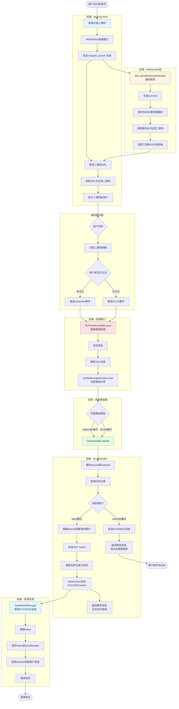
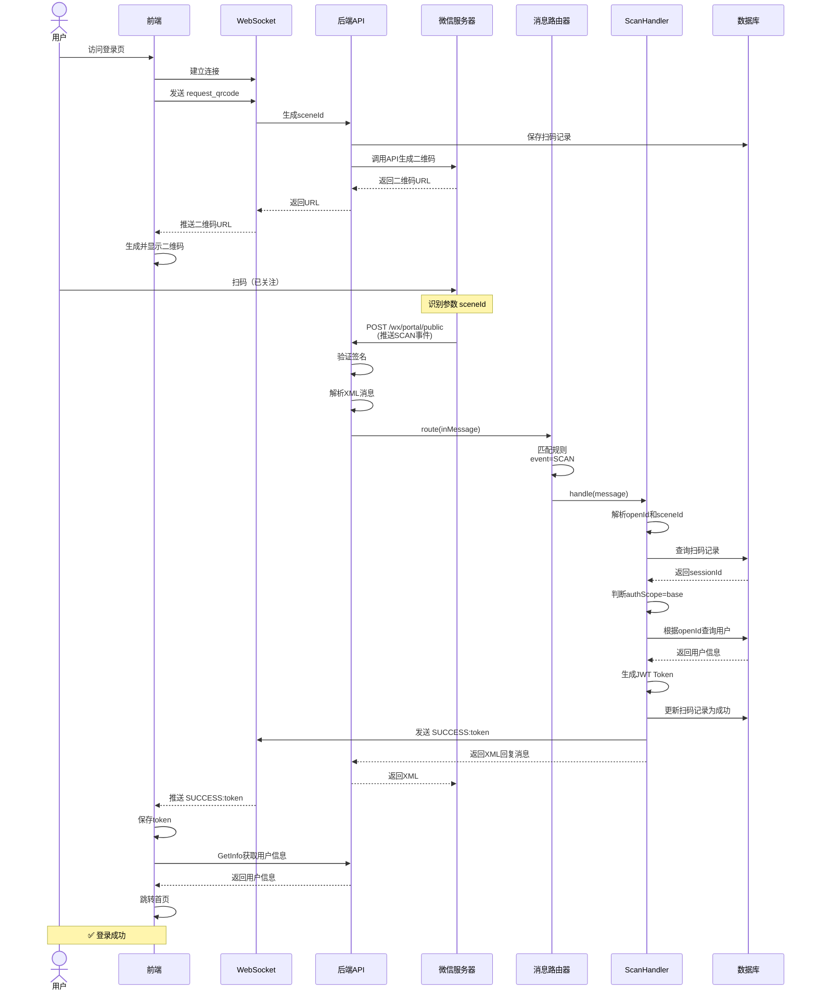
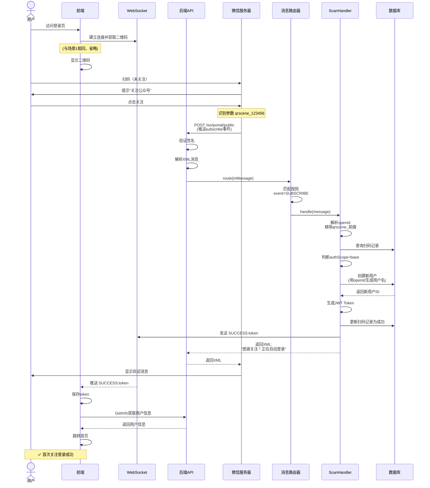
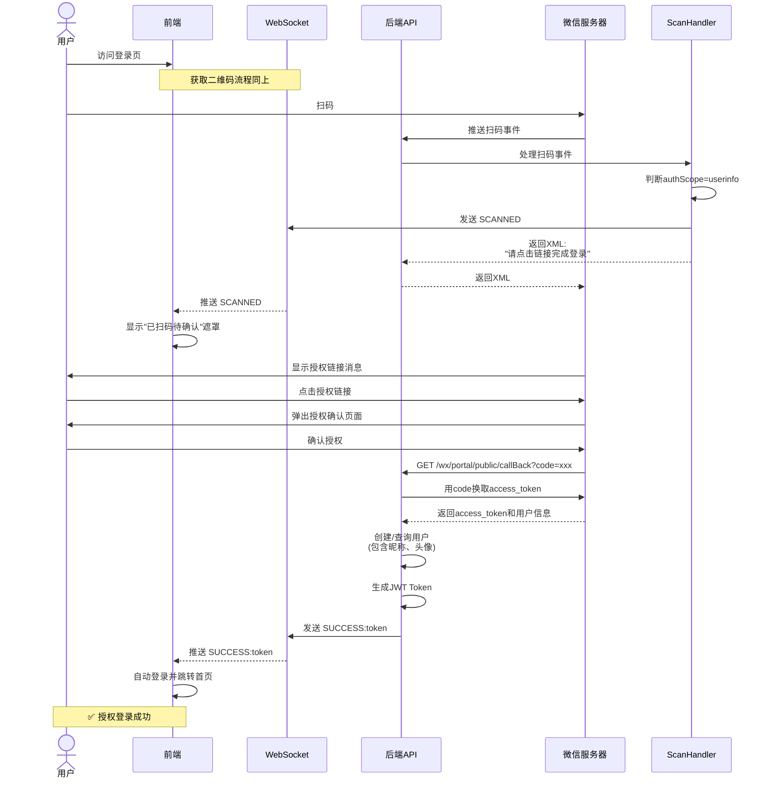

# 微信扫码登录完整流程与时序图

## 📋 业务概述

本文档详细说明微信扫码登录功能的完整调用链路，包括前端、后端、微信服务器之间的交互流程。

---

## 🔄 完整调用流程图



---

## ⏱️ 时序图

### 场景1：base模式 - 已关注用户扫码（最快路径）



---

### 场景2：base模式 - 首次关注扫码



---

### 场景3：userinfo模式 - 需要手动授权



---

## 🗂️ 核心类说明

### 前端 (daming-front)

| 文件 | 作用 |
|------|------|
| `src/views/login/index.vue` | 登录页面，WebSocket连接，二维码生成 |
| `handleWxMessage()` | 处理WebSocket消息：<br/>- 二维码URL<br/>- SCANNED<br/>- SUCCESS:token |
| `handleWxLoginSuccess()` | 保存token，获取用户信息，跳转首页 |

---

### 后端 - WebSocket层 (ruoyi-admin)

| 类 | 作用 |
|---|------|
| `WxLoginWebSocketHandler` | 处理WebSocket连接和消息<br/>- 接收 `request_qrcode`<br/>- 生成sceneId<br/>- 调用微信API生成二维码<br/>- 推送消息给前端 |

---

### 后端 - 回调接口层 (ruoyi-admin)

| 类 | 方法 | 作用 |
|---|------|------|
| `WxPortalController` | `post()` | 接收微信服务器推送的消息<br/>- 验证签名<br/>- 解析XML<br/>- 调用消息路由器 |

---

### 后端 - 路由配置层 (ruoyi-admin)

| 类 | 方法 | 作用 |
|---|------|------|
| `WxMpConfiguration` | `messageRouter()` | 配置消息路由规则<br/>- SUBSCRIBE → ScanHandler<br/>- SCAN → ScanHandler |

---

### 后端 - 业务处理层 (ruoyi-admin)

| 类 | 方法 | 作用 |
|---|------|------|
| `ScanHandler` | `handle()` | 处理扫码事件<br/>- 解析openId和sceneId<br/>- 创建/查询用户<br/>- 生成token<br/>- 推送给前端 |
| `DamingUserService` | `findOrCreateByWxInfo()` | 根据openId创建或查询用户 |
| `TokenService` | `createToken()` | 生成JWT Token |

---

## 📊 关键数据流

### 1. sceneId 的生成与传递

```
WebSocket生成sceneId
    ↓
保存到数据库 wx_scan_log (scene_id, session_id)
    ↓
传给微信API生成二维码
    ↓
用户扫码，微信识别sceneId
    ↓
微信回调时携带 EventKey=sceneId
    ↓
ScanHandler解析sceneId
    ↓
查询数据库获取sessionId
    ↓
通过sessionId找到对应的WebSocket连接
    ↓
推送消息给前端
```

---

### 2. openId 的作用

```
用户扫码 → 微信识别用户 → 推送openId
    ↓
ScanHandler接收openId
    ↓
查询数据库 daming_user (wx_open_id = openId)
    ↓
如果存在 → 返回现有用户
如果不存在 → 创建新用户(user_name = wx_openId)
    ↓
生成token (包含user_id)
    ↓
前端用token访问API
```

---

### 3. WebSocket 的双向通信

**前端 → 后端**：
```javascript
// 请求二维码
websocket.send('request_qrcode')
```

**后端 → 前端**：
```java
// 返回二维码URL
webSocketHandler.sendMessageToSession(sessionId, "https://...")

// 通知已扫码 (userinfo模式)
webSocketHandler.sendMessageToSession(sessionId, "SCANNED")

// 发送token (base模式)
webSocketHandler.sendMessageToSession(sessionId, "SUCCESS:token")
```

---

## 🎯 两种模式对比

| 特性 | base模式 | userinfo模式 |
|------|---------|-------------|
| **授权方式** | 静默授权 | 完整授权 |
| **用户操作** | 扫码即可 | 扫码+点击授权+确认 |
| **获取信息** | 只有openId | openId+昵称+头像 |
| **是否显示遮罩** | ❌ 不显示 | ✅ 显示"已扫码待确认" |
| **是否需要回调** | ❌ 不需要 | ✅ 需要callBack接口 |
| **登录速度** | ⚡ 最快 | ⏱️ 较慢 |
| **权限要求** | 测试号支持 | 需要正式号权限 |

---

## 🔧 关键配置

### application-dev.yml

```yaml
wx:
  mp:
    # 回调地址
    callback: http://10xh9vd648325.vicp.fun
    
    # 授权模式（base 或 userinfo）
    authScope: base
    
    # 公众号配置
    configs:
      - appId: wxeac644b6acef0405
        secret: xxx
        token: xxx
        aesKey: xxx
```

---

### 微信公众平台配置

**服务器配置**：
```
URL: http://10xh9vd648325.vicp.fun/wx/portal/public
Token: b3337731ab0711ef8c1fe79208535f88
EncodingAESKey: Hha4Su7QiNUEdj1jow5oQZtcIXVshfUXSClXRCpD1am
消息加解密方式: 安全模式
```

---

## 📝 数据表

### wx_scan_log（扫码记录表）

| 字段 | 类型 | 说明 |
|------|------|------|
| scene_str | varchar | UUID字符串 |
| scene_id | int | 场景ID |
| session_id | varchar | WebSocket会话ID |
| status | int | 状态：0-待扫码，1-已扫码，2-成功 |
| wx_open_id | varchar | 用户openId |
| user_id | int | 系统用户ID |

---

### daming_user（用户表）

| 字段 | 类型 | 说明 |
|------|------|------|
| user_id | bigint | 用户ID |
| user_name | varchar | 用户名(wx_openId) |
| wx_open_id | varchar | 微信openId |
| nick_name | varchar | 昵称 |

---

## 🚀 总结

### 核心流程

1. **前端**：WebSocket连接 → 请求二维码 → 显示
2. **用户**：扫码 → 关注（首次）
3. **微信**：推送事件 → 后端回调接口
4. **路由**：匹配规则 → 分发到Handler
5. **Handler**：解析消息 → 创建用户 → 生成token → WebSocket推送
6. **前端**：收到token → 保存 → 登录 → 跳转

### 技术要点

- ✅ WebSocket实现前后端实时通信
- ✅ 消息路由器自动分发不同事件
- ✅ sceneId关联前端会话和微信回调
- ✅ openId作为用户唯一标识
- ✅ base模式实现真正的扫码即登录

---

**文档创建时间**：2025-11-24  
**最后更新**：2025-11-24
