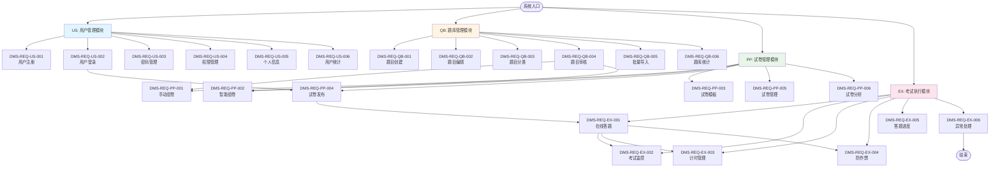

# 在线考试与学生成绩管理系统 - 功能模块流程图

## 系统功能模块结构图

## 功能模块详细说明

### 模块1：用户管理（US）

- **DMS-REQ-US-001**：用户注册
- **DMS-REQ-US-002**：用户登录
- **DMS-REQ-US-003**：密码管理
- **DMS-REQ-US-004**：权限管理
- **DMS-REQ-US-005**：个人信息
- **DMS-REQ-US-006**：用户统计

### 模块2：题库管理（QB）

- **DMS-REQ-QB-001**：题目创建
- **DMS-REQ-QB-002**：题目编辑
- **DMS-REQ-QB-003**：题目分类
- **DMS-REQ-QB-004**：题目审核
- **DMS-REQ-QB-005**：批量导入
- **DMS-REQ-QB-006**：题库统计

### 模块3：试卷管理（PP）

- **DMS-REQ-PP-001**：手动组卷
- **DMS-REQ-PP-002**：智能组卷
- **DMS-REQ-PP-003**：试卷模板
- **DMS-REQ-PP-004**：试卷发布
- **DMS-REQ-PP-005**：试卷管理
- **DMS-REQ-PP-006**：试卷分析

### 模块4：考试执行（EX）

- **DMS-REQ-EX-001**：在线答题
- **DMS-REQ-EX-002**：考试监控
- **DMS-REQ-EX-003**：计时管理
- **DMS-REQ-EX-004**：防作弊
- **DMS-REQ-EX-005**：答题进度
- **DMS-REQ-EX-006**：异常处理

## 模块间业务流程

1. **用户登录**（US-002）→ **试卷发布**（PP-004）→ **在线答题**（EX-001）
2. **题目审核**（QB-004）→ **手动/智能组卷**（PP-001/PP-002）→ **试卷发布**（PP-004）
3. **在线答题**（EX-001）过程中同时进行 **考试监控**（EX-002）、**计时管理**（EX-003）、**防作弊**（EX-004）
4. 如遇异常情况，触发 **异常处理**（EX-006）流程

