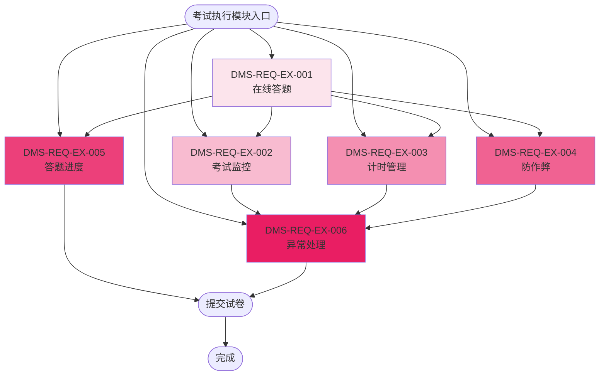

# 考试执行模块（EX）流程图

## 模块信息

- **模块编号**：EX
- **模块名称**：考试执行
- **模块简介**：支持在线考试全流程，包括答题、监控、计时、防作弊等执行功能

## 功能列表

| 序号 | 一级功能 | 功能编号 | 二级功能 | 功能编号 |
|------|---------|---------|---------|---------|
| 1 | 在线答题 | DMS-REQ-EX-001 | 答题进度 | DMS-REQ-EX-005 |
| 2 | 考试监控 | DMS-REQ-EX-002 | 异常处理 | DMS-REQ-EX-006 |
| 3 | 计时管理 | DMS-REQ-EX-003 | | |
| 4 | 防作弊 | DMS-REQ-EX-004 | | |

## 功能流程图

## 功能说明

### 一级功能

1. **DMS-REQ-EX-001：在线答题**
   - 学生在系统中查看题目并作答，支持选择题、填空题、主观题等题型

2. **DMS-REQ-EX-002：考试监控**
   - 教师或管理员实时监控考试过程，查看学生答题状态

3. **DMS-REQ-EX-003：计时管理**
   - 系统自动计时，显示剩余时间，时间到自动交卷

4. **DMS-REQ-EX-004：防作弊**
   - 检测切屏、复制粘贴等异常行为，记录并警告

### 二级功能

5. **DMS-REQ-EX-005：答题进度**
   - 显示学生已答题数、未答题数、标记题目等进度信息

6. **DMS-REQ-EX-006：异常处理**
   - 处理考试过程中的异常情况，如网络中断、系统错误等

