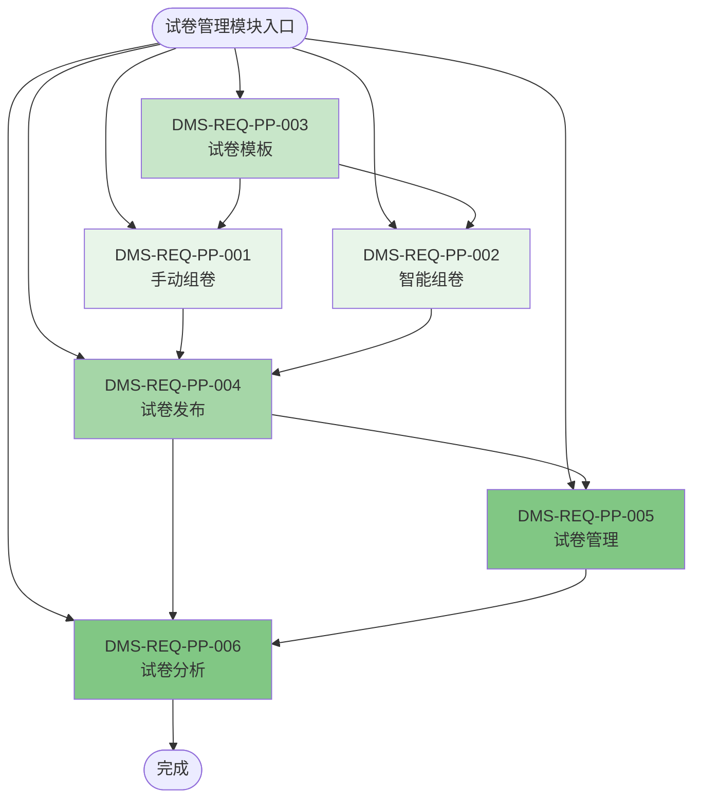

# 试卷管理模块（PP）流程图

## 模块信息

- **模块编号**：PP
- **模块名称**：试卷管理
- **模块简介**：处理试卷的创建、编辑、组卷、发布、模板管理等试卷业务逻辑

## 功能列表

| 序号 | 一级功能 | 功能编号 | 二级功能 | 功能编号 |
|------|---------|---------|---------|---------|
| 1 | 手动组卷 | DMS-REQ-PP-001 | 试卷管理 | DMS-REQ-PP-005 |
| 2 | 智能组卷 | DMS-REQ-PP-002 | 试卷分析 | DMS-REQ-PP-006 |
| 3 | 试卷模板 | DMS-REQ-PP-003 | | |
| 4 | 试卷发布 | DMS-REQ-PP-004 | | |

## 功能流程图

## 功能说明

### 一级功能

1. **DMS-REQ-PP-001：手动组卷**
   - 教师手动从题库中选择题目，配置分值和顺序，组成试卷

2. **DMS-REQ-PP-002：智能组卷**
   - 系统根据设定的条件（难度、知识点、题型等）自动从题库中选择题目组成试卷

3. **DMS-REQ-PP-003：试卷模板**
   - 保存常用的试卷结构作为模板，方便快速创建相似试卷

4. **DMS-REQ-PP-004：试卷发布**
   - 将已创建的试卷发布给学生，设置考试时间、对象等参数

### 二级功能

5. **DMS-REQ-PP-005：试卷管理**
   - 查看、编辑、删除已创建的试卷，管理试卷状态

6. **DMS-REQ-PP-006：试卷分析**
   - 分析试卷的难度分布、知识点覆盖、题型分布等数据

