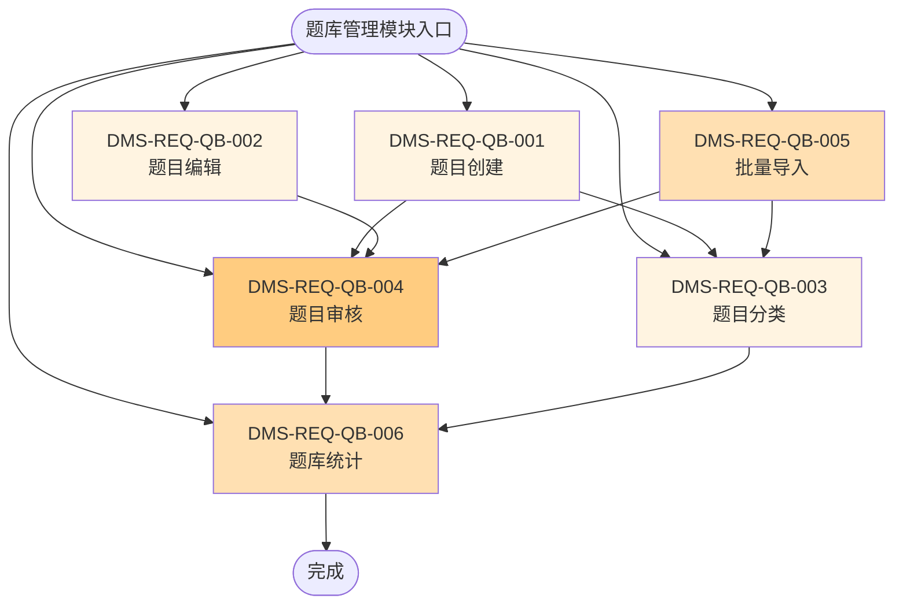

# 题库管理模块（QB）流程图

## 模块信息

- **模块编号**：QB
- **模块名称**：题库管理
- **模块简介**：管理题目的创建、编辑、分类、审核、批量导入导出等题库相关功能

## 功能列表

| 序号 | 一级功能 | 功能编号 | 二级功能 | 功能编号 |
|------|---------|---------|---------|---------|
| 1 | 题目创建 | DMS-REQ-QB-001 | 批量导入 | DMS-REQ-QB-005 |
| 2 | 题目编辑 | DMS-REQ-QB-002 | 题库统计 | DMS-REQ-QB-006 |
| 3 | 题目分类 | DMS-REQ-QB-003 | | |
| 4 | 题目审核 | DMS-REQ-QB-004 | | |

## 功能流程图

## 功能说明

### 一级功能

1. **DMS-REQ-QB-001：题目创建**
   - 教师或管理员创建新题目，填写题目内容、答案、难度等信息

2. **DMS-REQ-QB-002：题目编辑**
   - 修改已存在的题目内容、答案或属性

3. **DMS-REQ-QB-003：题目分类**
   - 将题目按科目、知识点、难度等维度进行分类管理

4. **DMS-REQ-QB-004：题目审核**
   - 审核题目内容是否正确，是否符合规范

### 二级功能

5. **DMS-REQ-QB-005：批量导入**
   - 通过Excel等文件批量导入题目到题库

6. **DMS-REQ-QB-006：题库统计**
   - 统计题库中题目数量、分类分布、难度分布等数据

