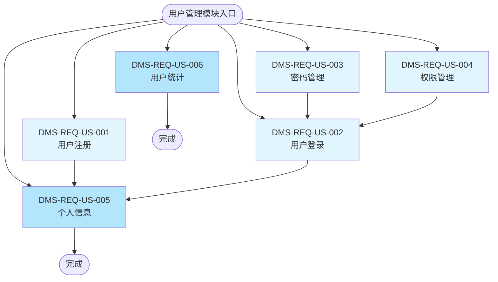

# 用户管理模块（US）流程图

## 模块信息

- **模块编号**：US
- **模块名称**：用户管理
- **模块简介**：负责用户注册、登录、权限管理、个人信息维护等基础用户功能

## 功能列表

| 序号 | 一级功能 | 功能编号 | 二级功能 | 功能编号 |
|------|---------|---------|---------|---------|
| 1 | 用户注册 | DMS-REQ-US-001 | 个人信息 | DMS-REQ-US-005 |
| 2 | 用户登录 | DMS-REQ-US-002 | 用户统计 | DMS-REQ-US-006 |
| 3 | 密码管理 | DMS-REQ-US-003 | | |
| 4 | 权限管理 | DMS-REQ-US-004 | | |

## 功能流程图

## 功能说明

### 一级功能

1. **DMS-REQ-US-001：用户注册**
   - 新用户填写注册信息，创建账户

2. **DMS-REQ-US-002：用户登录**
   - 已注册用户通过账号密码登录系统

3. **DMS-REQ-US-003：密码管理**
   - 用户修改密码、找回密码等功能

4. **DMS-REQ-US-004：权限管理**
   - 管理员分配用户角色和权限

### 二级功能

5. **DMS-REQ-US-005：个人信息**
   - 用户查看和修改个人基本信息

6. **DMS-REQ-US-006：用户统计**
   - 管理员查看用户数量、活跃度等统计数据

