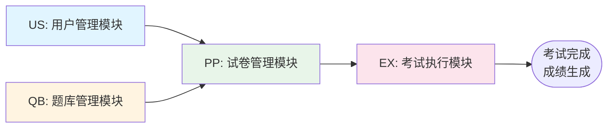

# 系统模块关系流程图

## 模块间业务流程

本图展示四个核心模块之间的业务流转关系。

## 业务流程说明

### 主要业务流程

1. **用户登录流程**
   - 用户通过 **用户管理模块（US）** 登录系统
   - 登录成功后进入系统主界面

2. **试卷准备流程**
   - 教师通过 **题库管理模块（QB）** 创建和审核题目
   - 审核通过的题目可用于组卷
   - 教师通过 **试卷管理模块（PP）** 进行手动或智能组卷
   - 组卷完成后发布试卷

3. **考试执行流程**
   - 学生通过 **考试执行模块（EX）** 参加已发布的考试
   - 系统在考试过程中进行监控、计时和防作弊
   - 考试结束后系统自动判分并生成成绩

## 模块依赖关系

- **试卷管理模块（PP）** 依赖 **用户管理模块（US）**：需要用户登录后才能发布试卷
- **试卷管理模块（PP）** 依赖 **题库管理模块（QB）**：组卷需要从题库中选择已审核的题目
- **考试执行模块（EX）** 依赖 **试卷管理模块（PP）**：只能参加已发布的试卷

