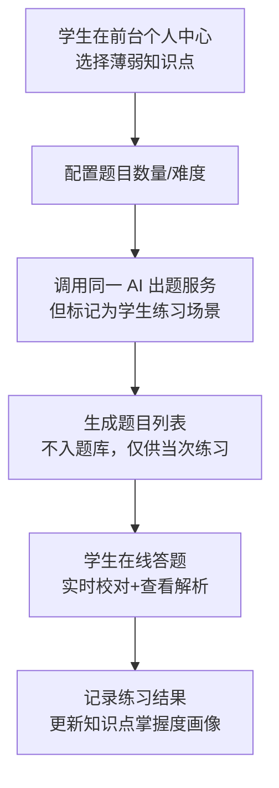

## AI 知识点出题服务业务文档

### 一、背景与目标

- **背景**：现有题库主要依赖人工录入，针对某个知识点集中生成练习题效率较低，且题目风格受个人影响较大。随着大模型技术成熟，希望引入 AI 能力，根据“知识点 + 出题要求”自动生成题目，用于练习与试卷组卷。
- **目标**：
  - **根据指定知识点自动生成多种题型题目**（选择、填空、简答等），支持配置难度与数量。
  - **生成结构化题目数据**，可直接写入题库并支持后续组卷。
  - **保证题目质量**，通过规则校验与人工审核机制过滤不合格题目。

### 二、角色与使用场景

- **管理员**
  - 维护知识点体系（树形结构）、标签与难度。
  - 配置 AI 出题策略（题型支持、最大数量限制、敏感词配置等）。
- **教师 / 出题人**
  - 在后台选择知识点、题型、难度，发起 AI 出题任务。
  - 预览 AI 生成的题目，可进行修改、删除、重新生成。
  - 将通过审核的题目写入题库或直接组卷。
- **学生（扩展场景）**
  - 在前台针对薄弱知识点一键生成练习题，用于自测与巩固。

### 三、业务流程概览（Mermaid）

#### 3.1 教师发起 AI 出题流程

```mermaid
flowchart TD
    A[教师进入后台出题页面\n选择知识点/题型/数量/难度] --> B[前端参数校验\n(必填项/范围/数量上限)]
    B --> C[调用后端 AI 出题接口]
    C --> D[后端校验知识点有效性\n& 用户权限]
    D --> E{知识点是否存在且有效?}
    E -- 否 --> E1[返回错误\n提示检查知识点配置] --> Z[结束]
    E -- 是 --> F[组装出题请求对象\n(知识点+题型+数量+难度)]
    F --> G[构造 Prompt\n(出题说明+格式约束)]
    G --> H[调用大模型 API\n生成题目原始文本]
    H --> I[解析模型输出为结构化题目对象]
    I --> J{解析是否成功?}
    J -- 否 --> J1[记录错误日志\n可触发重试或人工排查] --> Z
    J -- 是 --> K[执行题目内容校验\n(重复度/敏感词/格式)]
    K --> L{是否全部通过?}
    L -- 否 --> L1[标记不合格题目\n或直接过滤掉] --> M[组装结果\n含风险提示]
    L -- 是 --> N[写入临时题目列表\n不立即入正式题库]
    N --> M[返回生成的题目列表\n供教师预览/编辑]
    M --> O[教师人工审核\n可修改/删除/重新生成部分题目]
    O --> P{教师确认提交?}
    P -- 否 --> Z
    P -- 是 --> Q[将通过的题目批量写入题库\n关联对应知识点]
    Q --> Z[结束]
```

#### 3.2 学生自助练习（扩展）



### 四、功能模块设计

#### 4.1 知识点管理模块（已存在系统复用）

- **功能说明**
  - 支持按学科 / 章节 / 小节组织知识点树。
  - 每个知识点支持配置：名称、编号、描述、难度系数、标签（高频/易错/基础等）。
  - 为 AI 出题准备可读性较好的“知识点描述文本”，用于拼接到 Prompt 中。
- **关键点**
  - 尽量复用现有“知识点库简化版表结构”，避免重复建设。
  - 需要在知识点上增加一个字段：`ai_desc`（AI 出题描述），用于给大模型更清晰的语义。

#### 4.2 AI 出题服务模块

- **核心职责**
  - 接收前端传入的出题请求（知识点 + 题型 + 难度 + 数量）。
  - 整合知识点描述与出题规则，构造标准 Prompt。
  - 调用大模型接口（可封装统一的 LLMClient）。
  - 解析模型输出为结构化题目对象，并执行内容校验。

- **接口示例（后端 API 草案）**
  - `POST /api/ai/questions/generate`
  - **请求体示例**
    - `knowledgePointIds: number[]`：知识点 ID 列表。
    - `questionTypes: string[]`：如 `["single_choice","multiple_choice","blank","qa"]`。
    - `difficulty: string`：`EASY/MEDIUM/HARD` 或数值难度。
    - `count: number`：总题目数量或每种题型数量。
    - `scene: string`：`"TEACHER_BANK"` / `"STUDENT_PRACTICE"`。

- **返回体示例**
  - `questions: QuestionDTO[]`
    - `type`、`stem`、`options`、`answer`、`analysis`、`knowledgePoints`、`difficulty` 等字段。
  - `invalidQuestions: QuestionDTO[]`（可选）：被规则过滤的题目列表。

#### 4.3 题目校验与入库模块

- **校验规则**
  - **基础完整性**：题干非空；选择题选项数量合理；答案存在等。
  - **敏感内容过滤**：屏蔽政治/暴力/隐私等敏感词。
  - **重复度检查**：与现有题库做简单相似度对比，过滤高度重复题目。
  - **格式规范**：禁止模型输出解释性文字（如“下面是我为你生成的题目”）。

- **入库策略**
  - 教师确认后，将通过校验的题目批量写入题库表。
  - 存疑题目可打上 `status=CHECK_PENDING`，由教研或管理员二次审核。

#### 4.4 前端交互与页面设计（后台）

- **入口位置**
  - 后台 `题库管理` 下新增菜单：`AI 出题中心`。
- **主要页面元素**
  - 知识点选择器（支持树选择 + 多选）。
  - 题型多选框、难度选择、数量输入。
  - “生成题目”按钮 + 生成进度/加载状态。
  - 生成结果列表：题干、选项、答案、解析、知识点标签、难度等。
  - 每题支持操作：编辑、删除、重新生成类似题目。
  - 批量入库按钮：将选中题目写入题库。

### 五、AI 出题策略与 Prompt 设计

#### 5.1 Prompt 设计思路

- 明确告诉模型：
  - 它的角色是“专业出题老师/命题专家”。
  - 只能使用指定知识点，不要超纲。
  - 需要输出严格的 JSON 结构，便于后端解析。
  - 指定题型、数量、难度和语言。

- 示例 Prompt（伪代码思路）：

```text
你是一个专业的出题专家，请根据给定的「知识点列表」生成若干道题目。

要求：
1. 仅考察给定知识点，不要超纲。
2. 题目语言：中文。
3. 题型范围：{questionTypes}，难度：{difficultyLevel}。
4. 输出严格的 JSON 数组，每个元素包含字段：
   type, stem, options, answer, analysis, knowledgePoints, difficulty。
5. 不要输出除 JSON 以外的任何文字。

知识点列表（含简要说明）：
{knowledgePointDescList}

请生成总共 {count} 道题目。
```

#### 5.2 防御性策略

- 增加“最大题目数量”限制（例如每次不超过 50 题），防止超长输出。
- 当解析失败时，支持自动发起一次重试，重试 prompt 中加入“上次解析失败，请严格遵守 JSON 格式”提示。
- 重要场景（例如正式考试题）可以要求双重生成 + 人工抽查。

### 六、数据结构与数据库影响

- **题目表扩展**
  - 增加字段：
    - `source`：`MANUAL` / `AI` 标记题目来源。
    - `ai_model`：记录使用的大模型名称或版本（如 `gpt-4.1`）。
    - `ai_raw`（可选）：存储原始模型返回片段，便于排查问题。
  - 保持与现有题库表结构兼容，尽量不破坏原有功能。

- **知识点表扩展**
  - 新增字段 `ai_desc`：为 AI 使用的知识点解释文本。

### 七、非功能需求

- **性能**：单次出题请求整体响应时间控制在 3–10 秒，可接受一定程度的异步/进度提示。
- **安全**：对外调用大模型时注意 API Key 管理，避免泄露；对返回内容做敏感词过滤。
- **可观测性**：
  - 记录出题请求日志：用户、参数、耗时、成功/失败标记。
  - 记录题目生成质量相关指标（如教师删除率、修改率），后续可优化 Prompt。

### 八、里程碑与落地步骤（建议）

1. **第一阶段：可用 MVP**
   - 打通从“知识点选择”到“AI 生成题目并展示”的完整链路。
   - 简单规则校验 + 人工审核入库。
2. **第二阶段：质量提升**
   - 加入敏感词过滤、重复度检查、题型/难度更精细化控制。
3. **第三阶段：智能练习**
   - 为学生提供按掌握度推荐知识点并一键生成练习的能力。
   - 基于练习结果动态调整出题难度与知识点覆盖策略。


