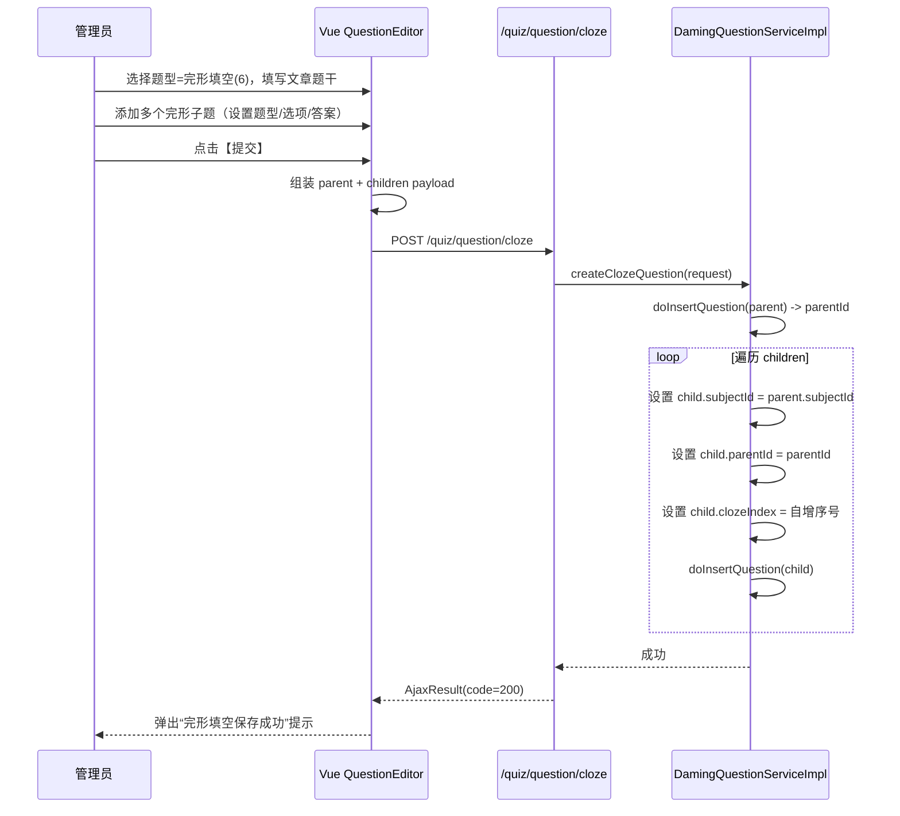
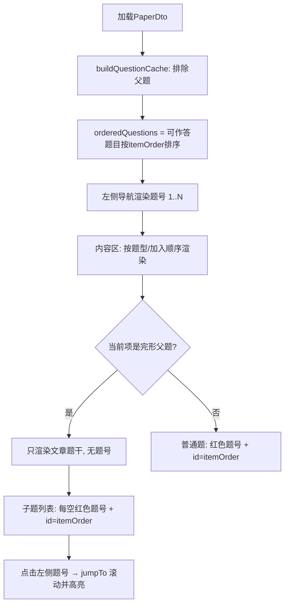
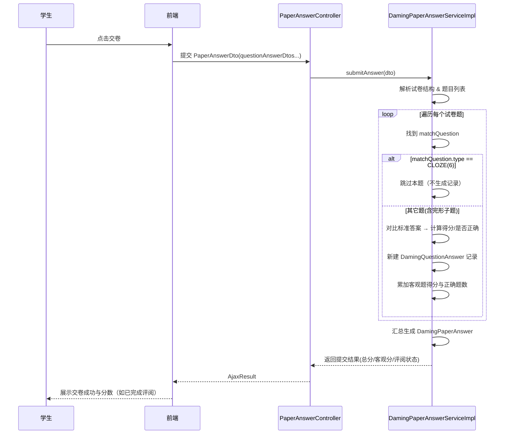

## 完形填空题型业务文档

> 日期：2026-03-09  
> 模块：题库 / 试卷 / 学生作答  

---

### 1. 业务目标

- 在大明刷题中支持 **完形填空** 题型：
  - 一条“文章父题”（含多个占位符 `{1}{2}...`）；
  - 多条“子题”（每个空是一道单选/多选/判断题）。
- **后台管理端**：在同一个页面一次性完成完形文章 + 所有子题的创建。
- **学生端**：按“上面文章、下面多题”的方式展示和作答。
- **判分统计**：只按子题计分，父题不生成答题记录、不计分。

---

### 2. 数据模型设计

#### 2.1 题目表 `daming_question`

- 关键字段：
  - `id`：题目 ID。
  - `question_type`：题型枚举（`QuestionTypeEnum`）：
    - `1` 单选题 `Single`
    - `2` 多选题 `Multiple`
    - `3` 主观题 `Subjective`
    - `4` 判断题 `Judge`
    - `5` 填空题 `FillBlank`
    - `6` **完形填空题 `Cloze`（仅父题使用）**
  - `parent_id`：
    - `NULL`：普通题 或 完形父题；
    - 非空：完形子题，指向其父题的 `id`。
  - `cloze_index`：
    - 完形子题所在的“第几空”（从 1 开始）；
    - 普通题和完形父题为 `NULL`。
  - `question_info_id`：关联 `DamingContentInfo.id`，存题干/选项/解析等 JSON。
  - `correct`：标准答案字符串（多选为逗号分隔）。
  - `score`：题目分数。
  - 其他字段：`subject_id`、`animation_id`、`del_flag` 等按原逻辑复用。

#### 2.2 内容表 `DamingContentInfo`

- 一张通用“内容表”，字段 `content` 为 JSON 串（`QuestionInfoContentVM`）。
- 在完形业务中的使用：
  - **父题**：
    - `question_type = 6`；
    - `content` 存整篇完形文章内容，可包含 `{1}{2}{3}` 等占位符；
    - 不需要 `correct` 答案。
  - **子题**：
    - `question_type = 1/2/4` 等普通客观题；
    - `content` 存该空的题干、选项、解析等；
    - `correct`/`correctArray` 存子题标准答案。

---

### 3. 后台一页创建完形题流程

#### 3.1 接口与 DTO 设计

- **URL**：`POST /quiz/question/cloze`
- **Controller**：`DamingQuestionController.addCloze`
- **入参 DTO**：`ClozeQuestionCreateRequest`

```java
public class ClozeQuestionCreateRequest {
    // 完形文章父题（questionType 最终会被强制设置为 6）
    private QuestionDto parent;
    // 完形子题列表（每条为一道普通题：Single/Multiple/Judge）
    private List<QuestionDto> children;
}
```

- **Service 接口扩展**：`IDamingQuestionService`

```java
void createClozeQuestion(ClozeQuestionCreateRequest request);
```

- **复用内部通用插入方法**（`DamingQuestionServiceImpl`）：

```java
// 通用插入：写 content + question，返回题目 ID
private Long doInsertQuestion(QuestionDto questionDto)
```

#### 3.2 Service 实现逻辑（伪代码）

```java
@Transactional
public void createClozeQuestion(ClozeQuestionCreateRequest request) {
    // 1. 校验父题
    QuestionDto parent = request.getParent();
    parent.setQuestionType(QuestionTypeEnum.Cloze.getCode()); // 强制为完形
    parent.setCorrect(null);
    parent.setCorrectArray(null);
    parent.setParentId(null);
    parent.setClozeIndex(null);

    // 2. 插入父题
    Long parentId = doInsertQuestion(parent);

    // 3. 插入子题
    List<QuestionDto> children = request.getChildren();
    AtomicInteger index = new AtomicInteger(1);
    for (QuestionDto child : children) {
        child.setSubjectId(parent.getSubjectId());
        child.setParentId(parentId);
        child.setClozeIndex(index.getAndIncrement());
        doInsertQuestion(child);
    }
}
```

#### 3.3 Controller 映射

```java
@PostMapping("/cloze")
@PreAuthorize("@ss.hasPermi('quiz:question:add')")
public AjaxResult addCloze(@RequestBody ClozeQuestionCreateRequest request) {
    damingQuestionService.createClozeQuestion(request);
    return success();
}
```

---

### 4. 后台页面交互（ruoyi-ui）

- 页面文件：`ruoyi-ui/src/views/quiz/question/single/index.vue`

#### 4.1 状态结构

- `formData` 关键字段：
  - `questionType`：题型（当为 `6` 时进入完形模式）；
  - `questionTitle`：父题文章题干；
  - `analysis`：整体解析；
  - `score`：整体分数（可按需要设置为子题分数之和或其它策略）；
  - `clozeChildren: []`：完形子题数组。

- `clozeChildren` 中每个元素结构：
  - `questionType`：1 单选 / 2 多选 / 4 判断；
  - `questionTitle`：子题题干；
  - `score`：该空的分数；
  - `items`: 选项数组（`{ prefix, content }`）；
  - `correct` / `correctArray`：标准答案。

#### 4.2 完形编辑 UI 行为

- 当 `formData.questionType === 6`：
  - **父题区域**：展示文章题干编辑器（富文本/Markdown），选项与单题答案区域隐藏。
  - **完形子题区域**：
    - 按钮：“添加子题” → 向 `clozeChildren` push 一条默认子题（单选 + ABCD）。
    - 每条子题渲染为一个 `el-card`，内部包含：
      - 题型下拉框（单选/多选/判断）；
      - 分数输入框；
      - 子题题干编辑器；
      - 选项编辑（可增删选项）；
      - 标准答案选择（单选/多选）。

#### 4.3 提交逻辑时序（后台页面）



---

### 5. 题号规则：父题不计入、子题连续编号

- **统一约定**：完形填空**父题不占题序**，只有**子题**参与全局题号（1、2、3…）。
- 无论试卷配置为“按题型分组”还是“按加入顺序”，均按此规则，保证题号连续、左侧导航与内容区一一对应。

#### 5.1 后端：下发试卷时重算 itemOrder

- 接口：`GET /quiz/student/paper/{paperId}` → `DamingPaperServiceImpl.paperIdtoDto`。
- 在组装 `QuestionDto` 时**不再直接使用 VM 中保存的 itemOrder**，而是按题型顺序遍历时**重新计算**：
  - **完形父题**（`questionType == 6` 且 `parentId == null`）：`itemOrder = null`，不参与编号。
  - **其余题目**（普通题 + 完形子题）：`itemOrder = 0, 1, 2, ...` 全局自增。
- 这样即使用户早期保存的试卷 JSON 里父题曾占过号，当前端再次拉取试卷时也会得到“父题无题号、子题连续”的 DTO，无需重新组卷。

#### 5.2 入卷与保存时的 itemOrder（insert/update）

- `DamingPaperServiceImpl.paperQuestionTypeDtoToVMString`（新增/修改试卷时）：
  - 完形父题：`questionVM.setItemOrder(null)`；
  - 其他题目：`questionVM.setItemOrder(index.getAndIncrement())`。
- 与 5.1 的“下发时重算”保持一致，从入卷起就遵循“父题不占号”的规则。

#### 5.3 itemOrder 处理流程总览

```mermaid
flowchart TB
    subgraph 组卷与保存
        A[前端组卷/编辑试卷] --> B[提交 PaperDto]
        B --> C[insert/updateDamingPaper]
        C --> D[paperQuestionTypeDtoToVMString]
        D --> E{遍历每道题目}
        E -->|完形父题| F[itemOrder = null]
        E -->|普通题/完形子题| G[itemOrder = 全局自增 0,1,2...]
        F --> H[写入 daming_content_info.content]
        G --> H
    end

    subgraph 下发试卷
        I[学生/管理端请求试卷] --> J[GET paper/{paperId}]
        J --> K[paperIdtoDto]
        K --> L[解析 paperInfoId 对应 JSON]
        L --> M{遍历每道题目}
        M -->|完形父题| N[itemOrder = null]
        M -->|普通题/完形子题| O[itemOrder = 全局自增 0,1,2...]
        N --> P[返回 PaperDto 给前端]
        O --> P
    end

    H -.->|同一试卷结构| L
```

---

### 6. 学生端试卷展示与作答

- 学生端页面：`daming-front/src/views/paper/index.vue`  
- 前端详细说明见同目录下 **《完形填空题型-前端说明》** 文档。

#### 6.1 试卷加载

1. 学生进入试卷作答页，前端调用：
   - `GET /quiz/student/paper/{paperId}` → `DamingPaperServiceImpl.paperIdtoDto`。
2. 后端根据 `paperInfoId` 解析出每个题型下的 `PaperQuestionTypeDto`，再根据各题型中的 `questionIds` 批量查询 `DamingQuestion`，转换为 `QuestionDto` 列表。
3. 对完形题而言：
   - 父题：`questionType = 6`，`parentId = null`，**itemOrder 为 null**；
   - 子题：`questionType = 1/2/4` 等，`parentId = 父题ID`，`clozeIndex = 1..N`，**itemOrder 为全局连续序号**。
4. 最终返回给前端的 `PaperDto` 中，`paperQuestionTypeDto[*].questionDtos` 已包含父题与子题及正确的题序关系。

#### 6.2 前端展示与题号逻辑（要点）

- **题目缓存 `orderedQuestions`**（`buildQuestionCache`）：
  - 遍历所有题型下的 `questionDtos` 时，**排除完形父题**（`questionType === 6`），只把普通题和完形子题加入列表，再按 `itemOrder` 排序。
  - 由此得到“可作答题目”的连续顺序，用于左侧题号、当前题高亮、防作弊单题切换等。
- **完形父题区域**：
  - **不展示题号**（无“4.”这样的红色题号），只展示文章题干 + “（完形填空）”标识。
- **完形子题区域**：
  - 每个子题前展示**红色题号**（如 `4.`、`5.`），且该元素设置 `id="child.itemOrder"`，以便左侧题号点击时 `jumpTo(itemOrder)` 能滚动到对应位置；
  - 题号取值：`getQuestionDisplayNumber(child)`，来源于 `questionIndexByOrder[child.itemOrder]`，保证与左侧列表一致。
- **左侧“题目进度”导航**：
  - 数据源为 `orderedQuestions`（已排除父题），因此题号 1、2、3… 与中间可作答题目一一对应；
  - 点击某题号 → `handleQuestionAnchorClick(question.itemOrder)` → `jumpTo(itemOrder)`，滚动到对应 DOM（普通题或完形子题），并高亮当前题号。



---

### 7. 提交与判分逻辑

- 提交答卷：`DamingPaperAnswerServiceImpl.submitAnswer`

#### 7.1 原有流程

1. 根据 `paperId` 查询 `DamingPaper`，再拿到 `paperInfoId` 对应的 `DamingContentInfo.content`（题目结构 JSON）。
2. 解析为 `List<PaperQuestionTypeVM>`，收集所有题目 ID → 批量查询 `DamingQuestion`。
3. 遍历试卷结构中的每一道“试卷题目 VM”，
   - 根据题目 ID 找到 `matchQuestion`；
   - 根据 `PaperAnswerDto.questionAnswerDtos` 找到学生的对应回答；
   - 按题型（单选/多选/判断/填空/主观）进行判分；
   - 生成 `DamingQuestionAnswer` 记录，累加客观题得分与正确题数。

#### 7.2 对完形填空的特殊处理

- 在判分循环中增加逻辑：

```java
if (Objects.equals(matchQuestion.getQuestionType(), QuestionTypeEnum.Cloze.getCode())) {
    // 完形父题：不作答、不计分，直接跳过
    return null;
}
```

- 最后对 `stream` 结果调用 `filter(Objects::nonNull)`，只保留非空的 `DamingQuestionAnswer`。
- 这样：
  - **父题不生成任何答题记录**；
  - 客观题得分、正确题数全部来自子题（包含完形子题）。



---

### 8. 后续可优化点（备忘）

- 完形父题整体分数与子题分数的关系：
  - 当前实现中，最终得分仅依赖子题 `score` 总和；
  - 可以根据需要，将父题 `score` 设为子题分数之和，便于统计“该完形整体满分是多少”。
- 错题本、收藏夹等：
  - 底层都是基于 `DamingQuestionAnswer` + `questionId` 操作，目前只对子题生效；
  - 若未来需要在错题本中以“完形为单位”展示，可以按 `parent_id` 聚合显示。

---

> 本文档用于指导后续维护与新同学快速上手完形填空题型的整体业务流程，包括：  
> 数据结构、接口设计、前后端交互、学生端展示与判分规则。  
> 如有改动（例如支持多段完形、跨题型组合等），请在本文件基础上补充更新。  
>  
> **前端实现细节**（题号展示、锚点跳转、组卷页操作等）见同目录：**《2-完形填空题型-前端说明》**。

