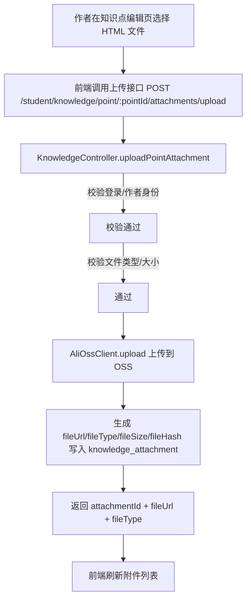
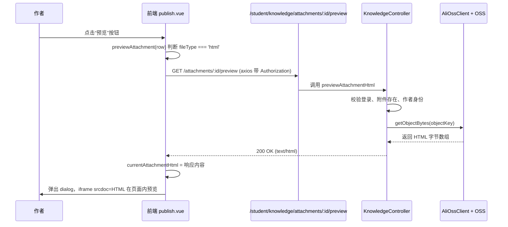

## 知识点附件 HTML 预览方案说明（学生端）

> 日期：2026-03-16  
> 模块：前台知识库 & 附件管理  
> 相关代码：`KnowledgeController`、`AliOssClient`、`daming-front/src/views/knowledge/publish.vue`、`daming-front/src/api/knowledge.js`

---

### 一、背景与问题

- 业务要求：为知识点上传 **HTML / 视频** 附件，供做题时跳转查看“辅助理解”内容，要求在弹窗内直接预览。
- 当前存储：附件统一上传到阿里云 OSS，访问地址使用 **OSS 默认域名**。
- 遇到的问题：
  - HTML 文件通过默认域名访问时，响应头包含：
    - `x-oss-force-download: true`
    - `Content-Disposition: attachment`
  - 浏览器会强制下载，`<a>` / `<iframe>` 打开都是“下载文件”，无法内嵌预览。
  - 即使生成签名 URL 尝试覆盖 `Content-Disposition=inline`，在当前 Bucket 策略下仍可能被 OSS 覆盖。
  - 前端 iframe 直连后端预览接口时，又因为 **缺少 Authorization 头** 导致 401。

**目标**：  
在不修改 OSS 安全策略、不新增表字段的前提下，实现：

- HTML 附件：在知识点编辑页面内弹窗预览，支持 JS 动画。
- 视频附件：继续走原有 URL，正常播放。
- 访问控制：仅知识点作者可上传/管理/预览附件。

---

### 二、整体方案概述

核心思路：**“后端负责读 OSS，前端只渲染 HTML 字符串”**。

1. **存储不变**：继续用 OSS 存文件，`file_url` 保留完整 URL。
2. **后端新增“预览能力”**：
   - 提供签名预览 URL（主要服务于视频等非 HTML）。
   - 对 HTML 增加 **代理预览接口**：后端从 OSS 读取 HTML 内容，以 `text/html` 返回。
3. **前端预览改造**：
   - 不再让 iframe 直接访问 OSS 或后端接口。
   - 使用 axios（带 token）请求后端 HTML 预览接口，拿到字符串后通过 `iframe srcdoc` 渲染。
   - iframe 开启 `sandbox="allow-same-origin allow-scripts"`，保证动画脚本可正常执行。

---

### 三、流程图

#### 1. HTML 附件上传 & 记录流程



#### 2. HTML 附件预览流程（关键）



---

### 四、后端设计说明

#### 4.1 OSS 客户端 `AliOssClient`

- **上传时的 Content-Type 处理**：
  - 根据文件后缀强制设置：
    - `.html/.htm` → `text/html;charset=UTF-8`
    - `.mp4/.webm/.ogg` → 对应 `video/*`
  - 其他类型优先使用浏览器上传的 `contentType`，否则默认 `application/octet-stream`。

- **签名 URL 生成（非 HTML 使用）**：
  - 方法：`generatePresignedUrl(objectName, expireSeconds, HttpMethod, responseContentType, responseContentDisposition)`
  - 用于生成带 `Content-Disposition=inline` 的访问地址，避免普通文件被下载。

- **新增：读取对象内容**：
  - 方法：`public byte[] getObjectBytes(String objectName)`
  - 使用 `getObject(bucket, key)` 读取 OSS 对象内容，返回 `byte[]`，供 HTML 代理预览使用。

#### 4.2 Domain：`KnowledgeAttachment`

- 新增非持久化字段：

```java
/** 预览URL（后端动态生成，如 OSS 签名URL） */
private String previewUrl;
```

- 仅通过 JavaBean getter/setter 和 `toString` 暴露，不在数据库映射中使用。

#### 4.3 控制器 `KnowledgeController`

1. **附件列表接口增强**

`GET /student/knowledge/point/{pointId}/attachments`

- 校验登录 & 作者身份不变。
- 查询附件列表后调用 `fillAttachmentPreviewUrl(list)`：
  - 对每条记录，根据 `fileUrl` 提取 OSS object key。
  - 调用 `buildPreviewUrlForAttachment` 生成签名 URL，写入 `previewUrl` 字段。
  - 目前视频等非 HTML 主要使用该 URL。

2. **单个附件签名预览 URL**

`GET /student/knowledge/attachments/{attachmentId}/previewUrl?expireSeconds=600`

- 功能：返回指定附件的签名预览 URL。
- 权限：
  - 必须登录。
  - 仅附件所属知识点作者可访问。
- 前端用于视频附件 `<video src>` 或在新标签页打开。

3. **HTML 代理预览接口（核心）**

`GET /student/knowledge/attachments/{attachmentId}/preview`  
`produces = "text/html;charset=UTF-8"`

处理逻辑：

- 校验登录用户、附件存在、知识点存在；
- 校验当前用户是该知识点作者；
- 校验已启用 OSS 且 `fileType == 'html'`；
- 从 `fileUrl` 中解析出 object key：
  - 支持完整 URL（`https://bucket.endpoint/path...`）和纯 key 两种形式；
- 调用 `aliOssClient.getObjectBytes(objectKey)` 读取内容；
- 使用 UTF-8 转成 HTML 字符串；
- 返回 `ResponseEntity<String>`，HTTP 200，`Content-Type: text/html;charset=UTF-8`。

> 注意：HTML 预览接口只返回内容，不做任何拼装或注入，前端负责包在 iframe 内渲染。

---

### 五、前端设计说明

文件：`daming-front/src/views/knowledge/publish.vue`

#### 5.1 数据结构

```js
data() {
  return {
    // ...
    attachments: [],
    attachmentPreviewVisible: false,
    currentAttachment: null,
    currentAttachmentHtml: '' // 存放 HTML 字符串，用于 srcdoc
  }
}
```

#### 5.2 API 封装

文件：`daming-front/src/api/knowledge.js`

- 获取附件列表：`getKnowledgeAttachments(pointId)`
- 上传/更新/删除：`uploadKnowledgeAttachment`、`updateKnowledgeAttachment`、`deleteKnowledgeAttachment`
- 获取签名预览 URL：

```js
export function getKnowledgeAttachmentPreviewUrl(attachmentId, expireSeconds = 600) {
  return request({
    url: `/student/knowledge/attachments/${attachmentId}/previewUrl`,
    method: 'get',
    params: { expireSeconds }
  })
}
```

- 获取 HTML 预览内容（代理接口）：

```js
export function getKnowledgeAttachmentPreviewHtml(attachmentId) {
  return request({
    url: `/student/knowledge/attachments/${attachmentId}/preview`,
    method: 'get'
  })
}
```

说明：

- `request` 是带有 `Authorization: Bearer <token>` 拦截器的 axios 实例，确保所有预览请求都在登录态下。

#### 5.3 预览弹窗与 iframe

模板片段：

```vue
<el-dialog
  title="附件预览"
  :visible.sync="attachmentPreviewVisible"
  width="80%"
  top="5vh"
  :close-on-click-modal="false"
>
  <div v-if="currentAttachment">
    <!-- HTML 附件 -->
    <div v-if="currentAttachment.fileType === 'html'" style="height: 70vh;">
      <iframe
        v-if="currentAttachmentHtml"
        :srcdoc="currentAttachmentHtml"
        style="width: 100%; height: 100%; border: none;"
        sandbox="allow-same-origin allow-scripts"
      />
      <el-empty v-else description="附件地址不存在或无效" />
    </div>

    <!-- 视频附件 -->
    <div v-else-if="currentAttachment.fileType === 'video'" style="text-align: center;">
      <video
        v-if="currentAttachment.fileUrl"
        :src="currentAttachment.fileUrl"
        style="max-width: 100%; max-height: 70vh;"
        controls
        controlsList="nodownload"
      >
        您的浏览器不支持视频播放，请尝试更换浏览器。
      </video>
      <el-empty v-else description="附件地址不存在或无效" />
    </div>
    <!-- 其他类型：略 -->
  </div>
</el-dialog>
```

关键点：

- HTML 通过 `srcdoc` 直接注入字符串，不再请求网络资源，避免 Token/跨域等问题。
- `sandbox="allow-same-origin allow-scripts"`：
  - 允许脚本执行（动画、交互正常）。
  - 同源保证脚本行为正常。
  - 仍禁止表单提交、弹窗等高危能力，降低风险。

#### 5.4 预览按钮逻辑

方法：`previewAttachment(row)`

```js
async previewAttachment(row) {
  if (!row || !row.attachmentId) {
    this.$message.warning('附件信息不完整')
    return
  }
  let previewUrl = row.previewUrl || row.fileUrl
  this.currentAttachmentHtml = ''

  if (row.fileType === 'html') {
    // 通过后端代理接口获取 HTML 字符串
    try {
      const html = await getKnowledgeAttachmentPreviewHtml(row.attachmentId)
      if (typeof html === 'string' && html.trim()) {
        this.currentAttachmentHtml = html
      } else {
        this.$message.error('获取HTML预览内容失败')
        return
      }
    } catch (e) {
      this.$message.error('获取HTML预览内容失败，请重试')
      return
    }
    previewUrl = ''
  } else {
    // 非 HTML 使用签名预览 URL（如果可用）
    try {
      const res = await getKnowledgeAttachmentPreviewUrl(row.attachmentId, 600)
      if (res && res.code === 200 && res.previewUrl) {
        previewUrl = res.previewUrl
      } else if (res && res.code === 200 && res.data && res.data.previewUrl) {
        previewUrl = res.data.previewUrl
      }
    } catch (e) {
      // 忽略异常，继续使用原始 fileUrl
    }
  }

  this.currentAttachment = { ...row, previewUrl, fileUrl: previewUrl }
  this.attachmentPreviewVisible = true
}
```

---

### 六、方案优劣与后续规划

**优点**

- 完全规避 OSS 强制下载策略，和是否使用自定义域名无关。
- 预览请求统一走后端 API，可复用现有登录&权限体系。
- 不改数据库结构，兼容历史数据。
- 对前端调用方暴露的是稳定的 HTTP 接口，后端可自由调整内部存储实现。

**局限 / 风险**

- HTML 内容在 iframe 中执行脚本，仍需确保上传者可信；若后续支持普通用户上传，需要增加内容安全校验（如 HTML 清洗）。
- 后端代理读取 OSS 内容会消耗一定带宽和 CPU，但预览场景访问频率较低，可接受。

**后续可选优化**

- 如果后续为 Bucket 绑定 **自定义域名** 并调整策略，理论上 HTML 也可直接用自定义域名内嵌预览，可作为备用方案。
- 为高频访问的 HTML 附件增加本地缓存（如 Redis / 本地文件），减少重复从 OSS 拉取的开销。

