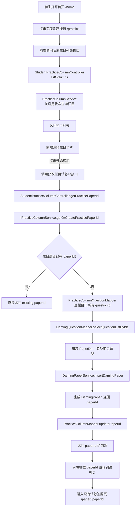
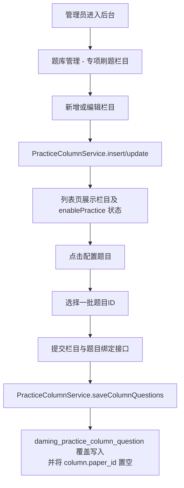

## 专项刷题栏（PracticeColumn）设计说明

> 日期：2026-03-16  
> 模块：题库 / 试卷 / 学生端专项练习  
> 相关代码：  
> - 后端：`PracticeColumn*`、`DamingPaperServiceImpl`、`StudentPracticeColumnController`、`PracticeColumnAdminController`  
> - 前端：`daming-front/src/api/practice.js`、`daming-front/src/views/practice/index.vue`、`daming-front/src/views/home/index.vue`  

---

### 一、需求概述

- 不再使用“标签”概念，而是新增一个**专项刷题栏**（栏目）：类似软考通首页里的“知识点练习栏目”。  
- 管理端可以：
  - 创建多个栏目（按科目归属）。
  - 为栏目勾选一批题目。
  - 控制栏目是否 **参与学生端“专项刷题”入口展示**（`enablePractice`）。
- 学生端可以：
  - 在“专项刷题”页看到可用栏目列表。
  - 点击某个栏目后，直接进入一套“根据该栏目题目生成的试卷”，进行专项练习。

整体上，这是一层独立于题目/试卷之上的“**练习集合配置层**”。

---

### 二、数据结构设计

#### 1. 表结构

```sql
-- 专项刷题栏目表
daming_practice_column(
  column_id      bigint PK,
  column_name    varchar(100)   -- 栏目名称
  subject_id     int            -- 科目ID（与题目/试卷科目对齐）
  description    varchar(500)   -- 栏目描述
  sort_order     int            -- 排序（越大越靠前）
  enable_practice tinyint(1)    -- 是否参与专项刷题筛选（1是0否）
  paper_id       bigint         -- 已为该栏目生成的试卷ID（可复用）
  create_user    varchar(64)
  create_time    datetime
  update_user    varchar(64)
  update_time    datetime
)

-- 栏目-题目关联表
daming_practice_column_question(
  id            bigint PK,
  column_id     bigint,         -- 栏目ID
  question_id   bigint,         -- 题目ID
  sort_order    int,            -- 栏目内题目顺序
  create_time   datetime,
  UNIQUE (column_id, question_id)
)
```

> SQL 位置：`daming-admin/sql/all/struct/2026-03-16/practice_column.sql`  
> 只负责结构，不做外键约束，方便后续数据迁移。

#### 2. 后端领域对象

- `com.dm.quiz.domain.PracticeColumn`
- `com.dm.quiz.domain.PracticeColumnQuestion`
- `com.dm.quiz.mapper.PracticeColumnMapper`
- `com.dm.quiz.mapper.PracticeColumnQuestionMapper`
- `com.dm.quiz.service.IPracticeColumnService`
- `com.dm.quiz.service.impl.PracticeColumnServiceImpl`

---

### 三、核心流程（时序 & 调用）

#### 1. 学生端整体流程图



说明：

- **只在第一次**点击栏目时，根据栏目下配置的题目 **动态生成一张试卷**，之后直接复用这张试卷的 `paperId`，保证“该栏目的练习是固定的一套题”。
- 若后台修改了栏目内题目，`saveColumnQuestions` 会清空原有 `paper_id`，下次再进时会重新生成试卷。

#### 2. 管理端配置流程



> 管理端 Controller：`PracticeColumnAdminController`  
> - `POST /quiz/practice/column`：新增栏目  
> - `PUT /quiz/practice/column`：编辑栏目（含 `enablePractice`）  
> - `POST /quiz/practice/column/{columnId}/questions`：绑定题目（全量覆盖）  

---

### 四、关键服务逻辑说明

#### 1. 获取 / 生成练习试卷

`PracticeColumnServiceImpl.getOrCreatePracticePaperId(Long columnId)`：

1. 校验栏目存在且配置了科目（`subjectId`）。  
2. 若 `column.paperId != null`，直接返回，**避免重复建卷**。  
3. 查询 `daming_practice_column_question` 获取栏目下全部 `questionId`（按 `sort_order`）。  
4. 批量查询 `daming_question`，构建 `QuestionDto`：
   - 最少只需填：`id`、`questionType`、`score`、`parentId`、`clozeIndex`。  
   - 组装到一个 `PaperQuestionTypeDto` 中，`name = "专项练习"`。  
5. 构建 `PaperDto`：
   - `paperName = "专项-" + columnName`  
   - `subjectId = column.subjectId`  
   - `paperType = 3`（自定义：专项练习）  
   - `suggestTime = 60`（可后续开放配置）  
   - `enableAntiCheat = false`  
   - `numberMode = 2`（按加入顺序编号）  
6. 调用 `IDamingPaperService.insertDamingPaper(paperDto)`：
   - 利用现有逻辑：
     - 把题目结构序列化到 `daming_content_info`。
     - 计算总题数 / 总分。
     - 统一处理完形填空父子题编号。  
7. 把生成的 `paperId` 反写到 `daming_practice_column.paper_id`，返回给调用方。

#### 2. 保存栏目题目

`PracticeColumnServiceImpl.saveColumnQuestions(Long columnId, List<Long> questionIds)`：

- 全量覆盖策略：
  1. `deleteByColumnId(columnId)` 清理旧关联。
  2. 按传入顺序写入 `daming_practice_column_question`，`sort_order` 从 0 递增。
  3. 调用 `PracticeColumnMapper.updatePaperId(columnId, null)` 清空已生成的 `paperId`，以便下次重新生成试卷。

---

### 五、前端实现说明

#### 1. API 封装

文件：`daming-front/src/api/practice.js`

```js
import request from '@/utils/request'

const module = '/quiz/student/practice'

export function listPracticeColumns(params) {
  return request({
    url: `${module}/columns`,
    method: 'get',
    params
  })
}

export function getPracticePaperId(columnId) {
  return request({
    url: `${module}/columns/${columnId}/paperId`,
    method: 'get'
  })
}
```

#### 2. 专项刷题列表页

路由：`/practice`（在 `router/index.js` 中已注册 `name: 'practice'`）  
组件：`daming-front/src/views/practice/index.vue`

主要行为：

1. `created` 时调用 `listPracticeColumns()` 拉取所有 `enablePractice=1` 的栏目。  
2. 渲染为卡片列表，展示 `columnName` / `description`。  
3. 点击“开始练习”：
   - 调用 `getPracticePaperId(columnId)`。
   - 从 `res.data.paperId` 拿到试卷ID。  
   - `this.$router.push({ name: 'paper', params: { paperId: String(paperId) } })`，复用现有试卷答题页。

#### 3. 首页入口

在 `home/index.vue` 的搜索面板下增加一个快捷入口：

```vue
<div class="mt-4 flex items-center justify-between">
  <div class="text-sm text-gray-500">
    想按栏目专项刷题？去「专项刷题」看看
  </div>
  <el-button type="primary" plain size="small" @click="gotoPractice">
    专项刷题
  </el-button>
</div>
```

```js
methods: {
  gotoPractice() {
    this.$router.push({ name: 'practice' })
  }
}
```

---

### 六、运维 / 启动相关 sh 命令示例

以下示例假设你在项目根目录执行，按需替换实际路径。

#### 1. 初始化专项栏目表结构

```bash
# 进入 SQL 目录
cd daming-admin/sql/all/struct

# 使用 mysql 导入 practice_column 结构（根据本地账号调整）
mysql -h127.0.0.1 -P3306 -uroot -p你的密码 ry-vue < 2026-03-16/practice_column.sql
```

#### 2. 启动后台服务（包含题库 & 学生端接口）

```bash
# 进入 ruoyi-admin 模块
cd daming-admin/ruoyi-admin

# 打包并启动（开发环境建议直接 IDEA 运行）
mvn -DskipTests clean package

# 或者只编译再用 IDE 跑
mvn -DskipTests compile
```

#### 3. 启动前台 `daming-front`

```bash
cd daming-front

# 安装依赖（首次）
npm install

# 本地开发启动
npm run dev
```

#### 4. 快速验证专项栏目接口

```bash
# 查看学生端可用栏目
curl -s "http://localhost:8080/quiz/student/practice/columns" \
  -H "Authorization: Bearer <token>" | jq

# 获取某栏目对应的试卷ID
curl -s "http://localhost:8080/quiz/student/practice/columns/1/paperId" \
  -H "Authorization: Bearer <token>" | jq
```

> 其中 `<token>` 为你当前登录用户在前端拿到的认证 Token，直接从浏览器的请求头复制即可。

---

### 七、后续可扩展点

- 在学生端“专项刷题”页中增加：
  - 每个栏目下题目总数、已练题目数、正确率等统计（基于 `daming_question_answer`）。  
  - 按科目分组展示栏目（与首页科目选择一致）。
- 栏目维度数据分析：
  - 每个栏目下的平均正确率、练习人数、错题知识点 TOPN。  
  - 可以直接复用现有试卷统计逻辑，按 `practiceColumn.paperId` 进行聚合。  

整体上，这个模块只是“题目/试卷之上的一层配置 + 入口”，不会破坏原有做题/试卷逻辑，后续改动风险较低。  

