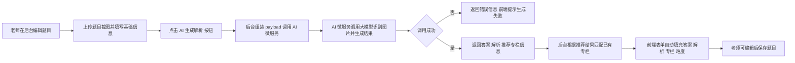

## 大明刷题 - 题目截图解析与专栏归属功能需求说明

### 1. 背景与目标

- **背景**  
  当前大明刷题后台在录入真题时，运营/老师通常从试卷或 PDF 中截图，将题目作为图片上传或粘贴到系统中。题目解析、正确答案、所属专栏需要人工调用豆包等大模型，多次复制粘贴，效率低且不稳定。

- **目标**  
  引入一个独立的 AI 微服务，基于题目截图和题目元信息（包含题目难度等），自动生成：
  - 该题的**标准答案**
  - 面向学生的**文字解析**
  - 一个**推荐的所属专栏**（从已有专栏库中选择，不再自动创建新专栏）
  减少人工操作，提升题目录入效率和一致性。

### 2. 范围与不在范围

- **本期范围（MVP）**
  - 支持题型：选择题（单选为主，可兼容多选但不保证最优效果）。
  - 支持学科：数学（高中为主），其他学科只做“尽力而为”不兜底。
  - 输入形式：单张题目截图图片（要求题干+选项完整清晰）。
  - 输出内容：
    - 标准答案（如 `"A"`/`"B"`/`"C"`… 或 `"A,B"`）。
    - 解析文本：面向学生阅读，包含解题思路和关键步骤。
    - 推荐专栏：优先从现有专栏列表中选择，必要时建议新专栏名称。
  - 业务入口：  
    - 后台题目管理页面（如单选题管理页）上的“AI 生成解析/答案/专栏”按钮。

- **暂不支持 / 不在本期范围**
  - 批量图片处理 / 批量解析。
  - 主观题、证明题、综合大题的高质量解析。
  - 多张图片合并为一题的复杂场景。
  - 复杂的知识点识别和知识图谱关联。

### 3. 角色与使用场景

- **角色**
  - 题库运营 / 教师：在后台管理端进行题目录入和编辑。
  - 管理员：配置 AI 调用开关、专栏推荐策略等（不允许自动创建新专栏）。

- **典型场景**
  1. 教师在后台创建一道新题，上传题目截图，填写基础元信息（学科、年级、题型等）。
  2. 点击“AI 生成解析”按钮。
  3. 系统调用 AI 微服务，返回答案、解析和推荐专栏。
  4. 页面将结果自动填入对应表单字段，教师可二次修改后保存。

### 4. 功能需求

- **4.1 题目截图解析调用**
  - 在单题编辑页增加一个按钮：**「AI 生成解析」**。
  - 点击后，前端将以下信息提交给后台：
    - 题目截图的 URL（或图片 ID）。
    - 基本元信息：学科、年级、题型、来源、难度等。
    - 当前可选专栏列表（或专栏 ID 集合）。
  - 后台组装统一的 `payload` 调用 AI 微服务。

- **4.2 AI 生成结果展示与编辑**
  - 后台收到 AI 结果后：
    - 自动将**题目答案、解析、所属专栏、题目难度**填充到表单中。
    - 自动设置所属专栏字段：
      - 若 AI 推荐了已有专栏（有匹配 ID），直接选中。
      - 若 AI 推荐新专栏，则标记为“待创建/待确认”。
  - 教师可以：
    - 手动修改答案和解析。
    - 手动修改专栏（重选或新建后关联）。
    - 手动调整题目难度。

- **4.3 专栏推荐策略**
  - AI 微服务**只在已有专栏候选列表中进行匹配和推荐**，不自动创建新专栏。
  - 如果认为所有候选专栏都不合适：
    - 可在结果中标记“未找到合适专栏”，并给出推荐的专栏名称建议字段（仅作提示用）。
    - 前端页面可提示：“AI 建议新专栏名称：xxx，请按需手动创建并关联”，但系统本身不执行自动创建。

- **4.4 错误处理与降级**
  - AI 微服务调用失败或超时时：
    - 页面给出友好提示：“AI 生成失败，请稍后重试”。
    - 不影响人工录入（仍可手动填写答案、解析、专栏）。
  - 对于模型明显识别失败的情况（例如无法看清图片），要求 AI 返回明确说明，避免“胡编”。

### 5. 非功能性需求

- **性能与时延**
  - 单次调用建议控制在 3～5 秒内返回，超过可判定为超时。

- **可用性**
  - AI 功能为增强功能，不可用时不应影响整体录题流程。

- **监控与日志**
  - 需要记录每次 AI 调用的请求/响应摘要（不记录完整图片内容），用于后续调优和问题排查。
  - 记录调用次数、失败率、平均时延等指标。

- **安全与费用控制**
  - 后端服务之间调用必须走内网或通过鉴权校验。
  - 对 AI 微服务调用做限流，防止误操作导致高额费用。

### 6. 交互流程（Mermaid 流程图）

### 7. 与现有系统的关系与影响

- 不改动现有题目存储结构的前提下，增加：
  - 题目编辑页：新增“AI 生成解析”按钮和对应前端交互。
  - 后端题目接口：增加调用 AI 微服务的逻辑。
- 新增一个独立的 AI 微服务工程，作为后端的“题目解析与专栏决策中心”。

