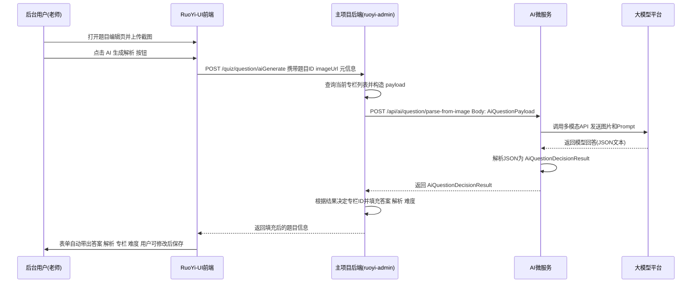

## 大明刷题 - 题目截图解析与专栏归属 AI 微服务技术方案

### 1. 总体设计

- **目标**  
  构建一个独立的 Spring Boot 高版本微服务，封装“题目截图 → 答案 + 解析 + 专栏推荐”的能力，对外提供统一 HTTP 接口，由现有大明刷题后台调用。  
  后续支持不同题型的扩展，特别是：
  - 单题选择题：输出单个答案 + 解析 + 专栏推荐。
  - 完形填空（含子题）：在父题层面上传整篇文章截图，由 AI 识别每个空，生成子题级别的答案与解析列表。

- **架构要点**
  - 微服务独立部署，使用 Spring Boot 3.x（后续可接入 Spring AI）。
  - 对接支持多模态（图文）的 LLM（如豆包多模态等）。
  - 只负责“计算逻辑”（AI 调用、专栏决策），不直接操作大明刷题主库表，避免强耦合。
  - 与大明刷题后台通过内部 HTTP/REST 调用交互。

### 2. 架构图（文字版）

- 前端（RuoYi-UI 后台题库页面）
- 后端（大明刷题主项目：`ruoyi-admin` + `dm_questionBank`）
- 新 AI 微服务（Spring Boot 3，负责图片解析与专栏决策）
- 大模型平台（多模态 API 提供方）

请求链路：  
前端 → 主项目后端 → AI 微服务 → 大模型平台 → AI 微服务 → 主项目后端 → 前端

### 3. 模块划分

- **AI 微服务模块**
  - `controller`：提供对外 REST 接口（供主项目调用）。
  - `service`：组装 Prompt、调用大模型客户端、解析模型结果、执行专栏决策逻辑。
  - `client`：和大模型平台的 HTTP 客户端（可后续替换为 Spring AI）。
  - `config`：模型调用参数（API Key、Base URL、超时、重试策略等）。
  - `dto`：请求/响应对象定义（`AiQuestionPayload`、`AiQuestionDecisionResult`等）。

- **主项目后端改造点**
  - 新增 `QuestionAiClient`：封装调用 AI 微服务的 HTTP 客户端。
  - 在题目管理相关 `Service` 中集成 `QuestionAiClient`。
  - 在 Controller 层提供“触发 AI 生成解析”的接口给前端。

### 4. 接口设计

#### 4.1 主项目 → AI 微服务请求 DTO（AiQuestionPayload）

```java
public class AiQuestionPayload {
    // 图片与基础信息
    private String imageUrl;
    private String subject;     // 学科，如 "数学"
    private String grade;       // 年级，如 "高三"
    private String questionType; // 题型，如 "single", "multiple"

    // 题目元信息，辅助判断专栏和解析风格
    private String difficulty;  // 难度，可选：easy/medium/hard
    private String source;      // 题目来源，如 "2024年某省一模"
    private List<String> tags;  // 标签，如 ["导数","函数","单调性"]

    // 当前已有专栏候选列表，供 AI 在其中优先选择（不自动创建新专栏）
    private List<ColumnCandidate> currentColumns;

    // 内部类：专栏候选
    public static class ColumnCandidate {
        private Long id;
        private String name;
    }
}
```

#### 4.2 AI 微服务 → 主项目响应 DTO（AiQuestionDecisionResult）

```java
public class AiQuestionDecisionResult {
    // 生成结果
    private String answer;          // 标准答案，如 "B" / "A,B"
    private String analysis;        // 解析文本

    // 专栏推荐（仅从已有专栏中选择）
    private String recommendedColumnName;    // 模型推荐的专栏名称（可以是 currentColumns 中的某一项名称）
    private Long matchedExistingColumnId;    // 如在 currentColumns 中找到最合适的
    private String matchedExistingColumnName;
    private boolean noSuitableColumnFound;   // 是否认为现有专栏都不太合适（仅提示，不自动创建）

    // 元信息
    private Double confidence;      // 可选：模型置信度
    private String modelMessage;    // 模型说明，如“图片不清晰”之类的信息

    // 可选：应试风格解析结构化结果
    private ExamStyleExplanation examStyleExplanation;
}

/**
 * 针对软考/应试场景的解析结构，约束输出风格，方便前端或调用方直接展示。
 */
public class ExamStyleExplanation {

    // 1. 最终答案信息
    private String finalAnswerText;   // 例如："正确答案：B"
    private String finalAnswerOption; // 例如："B"

    // 2. 题目难度与应试优先级
    // simple: 简单题(70%以内必会)，medium: 中等，hard: 难题可往后放
    private String difficultyLevel;

    // 3. 相关知识点/章节，便于记笔记分区
    private String knowledgePoint;    // 例如："计算机组成-进制转换"

    // 4. 需要用到的公式（如果有），按顺序列出
    private List<String> formulas;    // 例如：["带权路径长度公式: WPL = Σ wi * li"]

    // 5. 应试步骤提示：第一步/第二步/第三步，看到什么联想到什么
    private List<String> stepTips;    // 例如：["第一步：看到16进制→想到直接按记好的换算结果", "第二步：对比选项快速排除明显错误"]

    // 6. 额外技巧/备注（可选，保持简短）
    private String extraTips;         // 例如："属于送分题，优先拿分"
}
```

#### 4.3 完形填空专用响应 DTO（ClozeAiResult）

对于完形填空题型（`questionType = "cloze"`），在通用字段基础上，增加子题级别结果列表：

```java
public class ClozeAiResult extends AiQuestionDecisionResult {

    // 完形填空子题结果列表
    private List<ClozeItem> items;

    public static class ClozeItem {
        private Integer index;    // 第几空，从1开始，对应子题序号
        private String answer;    // 该空的正确选项，如 "A"
        private String analysis;  // 该空的解析
    }
}
```

当题型为完形填空时，AI 微服务返回 `ClozeAiResult`，主项目后端根据 `index` 将答案与解析写入对应子题记录。

#### 4.4 AI 微服务对外 REST 接口

```http
POST /api/ai/question/parse-from-image
Content-Type: application/json

Request Body: AiQuestionPayload

Response Body: AiQuestionDecisionResult
```

状态码约定：
- 200：调用成功，`AiQuestionDecisionResult` 内部需根据字段判断是否可用。
- 4xx：请求参数错误，如缺少 imageUrl、subject。
- 5xx：服务内部异常或大模型平台错误。

### 5. 大模型调用与 Prompt 设计

- **调用方式**
  - 使用 HTTP 客户端（如 WebClient/OkHttp）调用大模型平台多模态接口。
  - 消息结构通常为：
    - 图像内容（URL 或 base64）
    - 文本 Prompt（包含任务说明和输出 Schema）

- **Prompt 关键点（示意）**
  - 说明任务：
    - 根据题目截图和提供的 meta 信息，先确定题目答案，再给出详细解析，然后在给定的专栏列表里选择最合适的一个专栏。
  - 指定输出格式：
    - 只返回 JSON，字段名为：`answer`, `analysis`, `recommendedColumnName`, `matchedExistingColumnId`, `matchedExistingColumnName`, `noSuitableColumnFound`, `confidence`, `modelMessage`，以及可选的 `examStyleExplanation` 结构。
  - 约束：
    - 如果图片看不清或信息不足，必须在 `modelMessage` 中说明，并适当降低 `confidence`。
    - 仅从 `currentColumns` 中选择专栏，不自动创建新专栏；若都不合适，则将 `noSuitableColumnFound` 置为 true，并在 `recommendedColumnName` 中给出建议名称（可选）。

### 6. 专栏匹配与决策逻辑

- **输入**：AI 返回的 `recommendedColumnName`、`matchedExistingColumnId`、`noSuitableColumnFound` 以及原始 `currentColumns` 列表。

- **优先级策略（不自动创建新专栏）**
  1. 如果 `matchedExistingColumnId` 非空，主项目直接使用该专栏 ID 作为所属专栏。
  2. 如果 `matchedExistingColumnId` 为空：
     - 若 `noSuitableColumnFound = true`，则：
       - 在页面上提示：“AI 认为当前专栏列表中没有特别合适的专栏，可参考建议名称：recommendedColumnName（如有返回）。”
       - 不自动创建新专栏，由教师按需手动创建并关联。
     - 若 `noSuitableColumnFound = false`，则可以根据 `recommendedColumnName` 在已有列表中进行二次模糊匹配，或直接让教师手动选择。
  3. 如果 `confidence` 过低或 `modelMessage` 提示识别失败：
     - 前端提示用户“AI 对该题目把握不高，请仔细确认答案与专栏”，并允许完全人工编辑。

### 7. 调用链路时序图（Mermaid）



### 8. 异常处理与重试策略

- **AI 微服务内部**
  - 配置调用大模型的超时时间（如 5 秒）。
  - 对部分可重试错误（网络异常、限流）做有限次重试（如最多 2 次）。
  - 对不可重试错误（鉴权失败、参数错误）直接返回。

- **主项目调用 AI 微服务**
  - 设置整体超时控制，超时则返回统一错误信息给前端。
  - 不进行无限重试，防止放大问题。

### 9. 配置与开关

- 在主项目中提供配置项（可存于 sys_config 或自定义配置表）：
  - 是否开启 AI 解析功能（全局开关）。
  - 调用 AI 微服务的地址、超时配置。
  - 是否在页面上展示 AI 推荐但未匹配成功的专栏名称建议。

- 在 AI 微服务中通过配置文件管理：
  - 大模型平台的 Base URL、API Key。
  - 模型名称、温度等参数。

### 10. 后续扩展方向

- 支持多题型（判断、填空、综合题等）的解析。
- 支持批量图片解析任务（异步任务队列）。
- 引入 Spring AI，统一不同模型提供商的接入方式。
- 增加知识点识别，与知识点表进行关联，支持错题分析和知识图谱。

