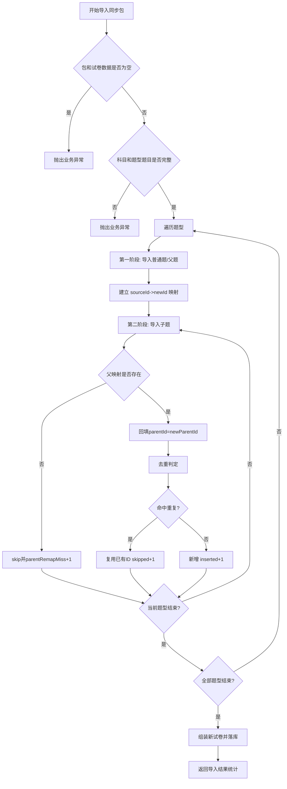
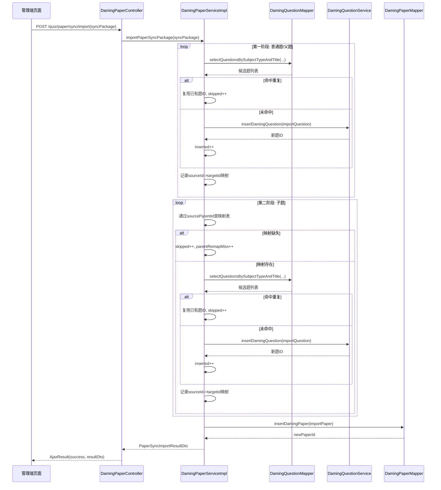

# 试卷同步功能技术文档

## 1. 功能目标

- 支持在源环境导出“试卷 + 题目”的完整同步包（JSON）。
- 支持在目标环境导入同步包，并自动完成题目导入。
- 题目导入时支持去重：若题目已存在则跳过复用，不重复创建。
- 导入完成后自动创建新试卷，并返回导入统计结果。

## 2. 涉及文件

- 后端接口层：`daming-admin/ruoyi-admin/src/main/java/com/ruoyi/web/controller/quiz/admin/DamingPaperController.java`
- 后端服务接口：`daming-admin/dm_questionBank/src/main/java/com/dm/quiz/service/IDamingPaperService.java`
- 后端服务实现：`daming-admin/dm_questionBank/src/main/java/com/dm/quiz/service/impl/DamingPaperServiceImpl.java`
- 后端 DTO：`daming-admin/dm_questionBank/src/main/java/com/dm/quiz/dto/PaperSyncPackageDto.java`
- 后端 DTO：`daming-admin/dm_questionBank/src/main/java/com/dm/quiz/dto/PaperSyncImportResultDto.java`
- Mapper 接口：`daming-admin/dm_questionBank/src/main/java/com/dm/quiz/mapper/DamingQuestionMapper.java`
- Mapper XML：`daming-admin/dm_questionBank/src/main/resources/mapper/quiz/DamingQuestionMapper.xml`
- 前端 API：`daming-admin/ruoyi-ui/src/api/quiz/paper.js`
- 前端页面：`daming-admin/ruoyi-ui/src/views/quiz/paper/index.vue`

## 3. 数据结构

### 3.1 导出/导入同步包 `PaperSyncPackageDto`

- `version`：包版本（当前 `v1`）
- `sourcePaperId`：源环境试卷 ID
- `paper`：`PaperDto`，包含题型与题目完整内容

### 3.2 导入结果 `PaperSyncImportResultDto`

- `newPaperId`：目标环境创建的新试卷 ID
- `insertedQuestionCount`：新增题目数量
- `skippedQuestionCount`：复用已有题目（跳过新增）数量
- `filteredQuestionCount`：被过滤题目数量（如空题干）
- `parentRemapMissCount`：子题父ID重映射失败数量

## 4. 接口说明

### 4.1 导出同步包

- 方法：`GET`
- 路径：`/quiz/paper/sync/export/{paperId}`
- 权限：`quiz:paper:query`
- 返回：`PaperSyncPackageDto`

### 4.2 导入同步包

- 方法：`POST`
- 路径：`/quiz/paper/sync/import`
- 权限：`quiz:paper:add`
- 请求体：`PaperSyncPackageDto`
- 返回：`PaperSyncImportResultDto`

## 5. 去重策略说明

系统采用“两段式去重”：

1. **候选筛选（SQL）**  
   按 `subjectId + questionType + questionTitle` 查候选题，减少比较规模。

2. **精确比较（Java）**  
   对候选题做深度比较：
   - 基础字段：科目、题型、题干、解析、分值、难度、年份、批次、父题关系、完形索引
   - 答案字段：多选按集合比较，其他题型按字符串比较
   - 选项字段：标准化为 `prefix|content|score` 列表后比较

命中则复用已有题目 ID，不命中则新增题目。

## 6. 父子题（复合题）ID 重映射（两阶段导入）

导入时维护 `sourceQuestionId -> targetQuestionId` 映射表，并采用两阶段策略：

1. 第一阶段（全局）：先导入所有题型中的普通题/父题（`parentId == null`），建立映射。
2. 第二阶段（全局）：再导入所有题型中的子题（`parentId != null`），通过 `sourceParentId` 查映射表回填 `newParentId`。
3. 若子题找不到父映射，跳过并累计 `parentRemapMissCount`。
4. 兼容历史数据：`parentId <= 0` 统一视为顶层题，不当作子题处理。
5. 两阶段完成后按源题原始顺序重建列表，避免子题被统一追加到末尾。

## 7. 流程图（Mermaid）

## 8. 时序图（Mermaid）

## 9. 前端交互说明

- 试卷列表页新增按钮：
  - **导出同步包**：选中一条试卷后下载 JSON
  - **导入同步包**：上传 JSON 后调用导入接口
- 导入成功后弹出提示：
  - 新试卷 ID
  - 新增题目数量
  - 跳过题目数量

## 10. 已知注意点

- 去重依赖题干、答案、选项等字段的一致性；若源/目标环境内容有细微差异，可能判定为新题。
- 建议保留 `version` 字段，后续可以按版本做兼容扩展。
- 同步包是业务数据，建议通过权限和审计日志控制导入操作。

