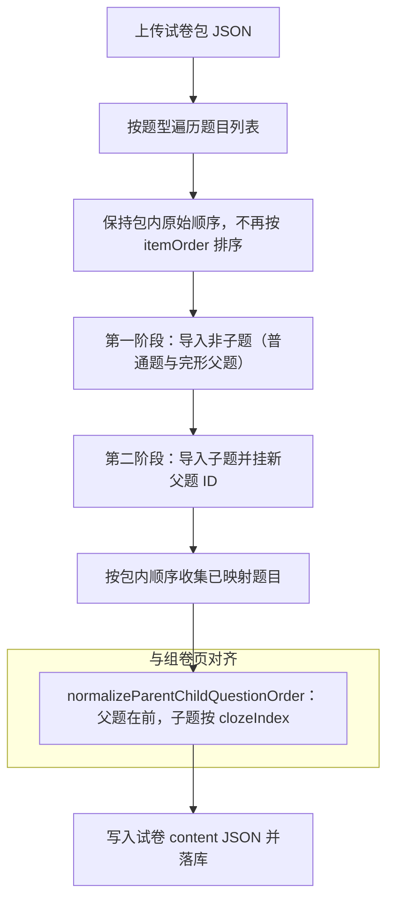

# 试卷包导入与组卷「子题顺序」修复说明

## 一句话总结

**完形填空**在试卷里是「一道父题 + 多道子题」。导出试卷包时顺序是对的（父在前、子紧跟），但**导入**时曾用 `itemOrder` 排序，把**没有题号的父题**排到了**子题后面**，写进数据库的题目顺序就乱了，看起来像子题丢了、题数不对。修复后：**不再用 `itemOrder` 打乱包内顺序**，并在写库前**强制整理成「父题 → 子题」**，与后台组卷页「按原卷题序」展示逻辑一致。

---

## 为什么会出现「子题像丢了」

| 概念 | 说明 |
|------|------|
| 完形父题 | 题型为完形（材料），**不占卷面小题号**，所以后端给它算的 `itemOrder` 常常是 **空（null）** |
| 完形子题 | 每一空一道小题，有正常递增的 `itemOrder`（0、1、2…） |
| 组卷页 | 列表里只展示父题，子题跟在父题后面（前端 `applyDisplayOrder`） |
| 旧版导入 | 按 `itemOrder` 从小到大排序：**有数字的子题在前，父题（null）被挤到最后** |

顺序一旦变成「先子、后父」，和系统其它地方约定不一致，学生端/统计/题号展示就容易异常，用户会感觉「子题没了」或「题目数量乱了」。

---

## 流程图（修复后在导入里多做了什么）

**修复前**与上面的差异：在步骤 C 处会先做 **按 itemOrder 排序**，导致父题（null）排到子题后面；步骤 F 按这个错误顺序写回；**没有**步骤 G。

---

## 举例（数字越小表示在列表里越靠前）

### 假设试卷包里某题型只有一道完形：1 个父题 + 2 个子题

导出时（正确顺序）：

| 顺序 | 角色 | itemOrder（示意） |
|------|------|-------------------|
| 1 | 父题（材料） | **null**（不占号） |
| 2 | 子题① | 0 |
| 3 | 子题② | 1 |

### 修复前（按 itemOrder 排序后）

排序规则：`null` 排在最后。

| 顺序 | 角色 | 问题 |
|------|------|------|
| 1 | 子题① | 父题还没出现在前面 |
| 2 | 子题② | 同上 |
| 3 | 父题 | 材料跑到最后 |

写进数据库的试卷内容如果按这个顺序存，和「先材料、再小题」的展示约定相反，就会出现你看到的错乱。

### 修复后

1. **不**再按 `itemOrder` 重排，先保持包里的：父 → 子① → 子②。  
2. 映射完成后，再跑一遍 **父题 + 子题归并**（与组卷页拖拽后的结构一致）：结果仍是 **父 → 子① → 子②**。

---

## 顺带：加载试卷时也多了一道保险

在 `paperIdtoDto`（编辑试卷、导出试卷包时从库读结构）里，对每个题型列表也会做一次同样的 **父题/子题顺序整理**。这样即使历史上已经存过「子题在前」的旧数据，读出来展示或再导出时也会尽量纠正。

---

## 代码位置（便于对照）

- 类：`daming-admin` 模块内 `com.dm.quiz.service.impl.DamingPaperServiceImpl`
- 方法：`importPaperSyncPackage`（导入流程）、`normalizeParentChildQuestionOrder`（整理顺序）、`paperIdtoDto`（读卷后整理）

---

## 你需要记住的使用层面结论

1. **导入试卷包**：完形子题应始终跟在对应父题后面，题量与组卷页一致。  
2. **若仍有个别子题进不了卷**：更可能是去重、父题映射失败、或子题校验未通过（与本次「顺序」修复无关），可看导入接口返回的统计字段排查。
